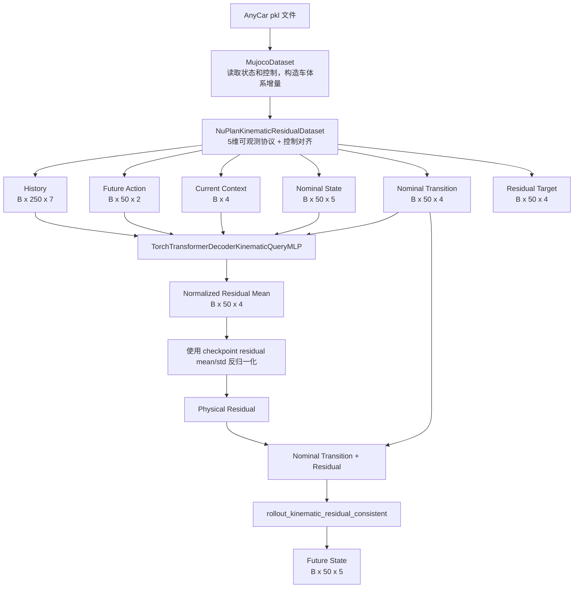

# AnyCar 当前确定性 Query 模型、训练与代码功能总览

本文基于 `fork-main` 分支提交 `11fa157132453c7d1e96f3a2205128d2edc24a5d` 检查当前代码，说明正在使用的模型、数据协议、仿真预训练、实车微调、推理方式和主要文件职责。检查日期为 2026-07-29。

详细的结构和历史实验指标另见 [当前 Query 运动学残差模型与训练方式](current_kinematic_query_model_and_training_20260728.md)。本文更偏向代码阅读、运行和维护。

## 1. 当前状态

当前默认模型是：

```text
TorchTransformerDecoderKinematicQueryMLP
+ 固定运动学自行车 nominal rollout
+ 4 维确定性残差预测
+ 物理一致的未来状态积分
```

当前不启用概率输出：

- 模型只返回残差均值 Tensor，不返回 Sigma、Expected Error 或 Tail Probability；
- 仿真训练和实车微调默认都只选择 `query` 分支；
- S0/S6-B 等概率脚本仅保留为暂停的离线研究，不在正常调用链中；
- 新运行生成的 summary 使用 `probability_output_enabled: false` 标记输出协议；旧 checkpoint 本身仍以单 Tensor 输出和模型结构为准。

当前推荐的实车 checkpoint：

```text
outputs/formal_real_finetune_query_baseline_split/20260728T143256/query_best.pt
```

其仿真来源 checkpoint：

```text
outputs/formal_kinematic_residual_query_30epoch/20260728T114849/query_best.pt
```

## 2. 从数据到预测的完整流程



网络输出和最终轨迹不是同一个张量：

```text
网络直接输出: normalized residual mean [B, 50, 4]
物理最终输出: future state             [B, 50, 5]
```

## 3. 数据协议

### 3.1 原始通道

`MujocoDataset` 从 pkl 中读取：

```text
[x, y, yaw, vx, vy, yawrate, throttle, steer]
```

它完成以下工作：

1. 四元数转换为 yaw；
2. 绝对状态转换为逐步 delta；
3. `dx/dy` 从世界坐标旋转到当时的车体坐标；
4. 将数据切成不重叠的 history + future 窗口；
5. 兼容 NumPy 2.x 生成、NumPy 1.26 环境读取的 pickle module 路径。

当前模型不使用 `vy`，对外暴露的状态是：

```text
[x, y, yaw, vx, yawrate]
```

### 3.2 一个训练样本的时间索引

基础数据集使用：

```text
history_length = 250 + 1
prediction_length = 50
完整窗口长度 = 301
```

多出的 1 帧用于定义“当前绝对状态”。进入模型前会丢弃最早一帧 delta，因此模型实际收到 250 帧历史。

| 数据 | 时间位置/形状 | 用途 |
|---|---|---|
| History | `[B,250,7]` | 5 维状态增量 + 2 维历史控制 |
| Initial state | raw index 250，`[B,5]` | nominal rollout 和最终 rollout 起点 |
| Future action | `[B,50,2]` | 第一维控制 + 对齐后的转向 |
| Truth | raw index 251–300，`[B,50,5]` | rollout 监督和评价 |

控制默认使用 `steer_shift=1`：

```text
transition t -> t+1 使用 [throttle[t], steer[t+1]]
```

这是为了匹配当前数据生成器的记录时序。部署或更换数据源时必须重新确认该对齐关系。

### 3.3 运动学 nominal 和残差目标

固定自行车模型参数为：

| 参数 | 值 |
|---|---:|
| `dt` | 0.05 s |
| `wheelbase` | 3.9 m |
| `steering_ratio` | 25.0 |
| `steering_offset` | 5 deg |

模型使用 4 维一致转移：

```text
[dx_body, dy_body, dvx, dyawrate]
```

训练目标为：

```text
direct_target   = observed physical transition
base_transition = fixed bicycle model transition
residual_target = direct_target - base_transition
```

`yaw` 不作为独立网络输出，而是在 rollout 中使用当前 `yawrate * dt` 积分。这让位置、yaw 和 yawrate 使用同一套物理更新规则。

nominal state/transition 只使用当前状态和给定的未来 action 生成，不读取 future truth，因此训练和推理的 Query 输入协议一致。

## 4. 模型结构

### 4.1 类继承关系

```text
TorchTransformerDecoder
  -> TorchTransformerDecoderCurrentState
    -> TorchTransformerDecoderCurrentStateMLP
      -> TorchTransformerDecoderKinematicQueryMLP
```

各层新增能力：

| 类 | 主要功能 |
|---|---|
| `TorchTransformerDecoder` | History Conv1d、future action query、Transformer Decoder、输出 Head |
| `CurrentState` | 把当前状态/控制加入 future query |
| `CurrentStateMLP` | 用零初始化的 MLP 残差分支替换线性融合 |
| `KinematicQueryMLP` | 再加入 nominal state/transition 的零初始化 Query 分支 |

### 4.2 History memory

历史输入：

```text
B x 250 x 7
= 5 state channels + 2 control channels
```

状态和控制分别通过两层 Conv1d 压缩到 42 帧，再映射到 256 维。两个分支按时间交错后去掉最后一个 token：

```text
42 state tokens + 42 action tokens - 1 = 83 history tokens
```

最终 history memory 为：

```text
B x 83 x 256
```

### 4.3 Future Query

每个未来时刻的 Query 是三项相加：

```text
q_t = Linear(action_t)
    + MLP([action_t, current_context])
    + MLP([action_t, current_context,
           nominal_state_t, nominal_transition_t])
```

维度为：

| 分支 | 输入/内部维度 |
|---|---|
| Action embedding | `2 -> 256` |
| Current-context MLP | `6 -> 128 -> 256` |
| Kinematic Query MLP | `15 -> 128 -> 256` |

两个 MLP 的末层在新建模型时都从零开始，使新增分支初始时不破坏基础 action embedding。

### 4.4 Transformer 和输出

| 配置 | 值 |
|---|---:|
| `d_model` | 256 |
| Decoder layers | 3 |
| Attention heads | 4 |
| FFN dimension | 512 |
| Dropout | 0.1 |
| Future horizon | 50 |
| Mean Head | `Linear(256,4)` |
| 可训练参数 | 2,478,970 |

Future Query 使用 causal mask，并 cross-attend 83 个 history tokens。输出只包含归一化残差均值。

## 5. 归一化

所有统计量只应由训练集生成。当前 checkpoint 保存六组 mean/std：

| Key | 维度 | 使用位置 |
|---|---:|---|
| `history` | 5 | 只归一化历史的状态部分；历史控制保持原值 |
| `context` | 4 | 当前 `vx/yawrate/control` |
| `direct` | 4 | 通用物理转移评价坐标 |
| `residual` | 4 | 网络训练目标和输出反归一化 |
| `nominal_state` | 5 | Kinematic Query 输入 |
| `nominal_transition` | 4 | Kinematic Query 输入 |

Future action 本身不做统一 mean/std 归一化，而是直接进入 action embedding。

代码中该控制第一维沿用数据字段名 `throttle`，但固定运动学模型把它按纵向加速度解释；实车评估 summary 中对应 `acc_fused`。接入新的控制源前必须统一单位和物理语义。

## 6. 仿真预训练

当前入口：

```text
scripts/model_verify/train_kinematic_residual_ablation.py
```

默认 `--models query`，不会构造概率 Head。脚本仍允许显式选择 `direct/residual/query`，用于确定性消融。

### 6.1 正式数据和拆分

```text
/disk/collect_data_from_anycar/New_demo/new_data_with_x_mean_zero/total_data_1
```

当前正式 run 使用固定 seed 3407，从目录随机选择 20,000 个 pkl，再做文件级拆分：

| Split | pkl | 有效 episode |
|---|---:|---:|
| Train | 16,000 | 96,000 |
| Validation | 3,000 | 18,000 |
| Test | 1,000 | 6,000 |

注意：当前仿真训练入口是 seeded file-level split，不是 session-isolated split。`create_anycar_session_splits.py` 可以生成时域隔离 manifest，但当前预训练入口尚未直接接收 manifest；如要进行严格跨 session 训练，需要先补充该接口。

### 6.2 损失和选模

归一化残差加权 MSE：

```text
channel = [dx_body, dy_body, dvx, dyawrate]
weight  = [0.5,     0.5,     0.5, 2.5]
```

正式 run 使用：

```text
L_sim = L_transition
rollout_loss_weight = 0.0
selection_metric = validation rollout score
```

因此 rollout score 用于选 checkpoint，但不进入仿真阶段的反向传播。

正式 run 关键参数：

| 配置 | 值 |
|---|---:|
| Epoch | 30 |
| Batch / eval batch | 256 / 512 |
| AdamW learning rate | `5e-4` |
| Weight decay | `1e-4` |
| LR decay | 每 epoch 乘 `0.99` |
| Validation interval | 5 epochs |
| 最佳 epoch | 30 |

代码无参数运行时的默认值和正式 run 不完全相同：默认 `max_files=0`、`epochs=0`、`val_every=10`、`selection_metric=val_loss`。要复现正式模型必须使用第 12 节的完整命令。

## 7. 实车微调

当前入口：

```text
scripts/model_verify/finetune_real_kinematic_residual.py
```

默认只加载和训练 `query`，所有模型参数都参与微调，不是只训练 Query MLP 或输出 Head。

### 7.1 数据和拆分

```text
/disk/collect_data_from_anycar/data_from_bag/new_temp_data/pkg_file
```

推荐固定使用：

```text
outputs/splits/session_isolated_real_v1
```

脚本会检查：

- manifest 文件存在且非空；
- split 内没有重复文件；
- train/validation/test 文件和 acquisition-minute group 均不重叠；
- 原始数值有限、四元数合理、位置无异常跳变；
- yaw 与 yawrate 的积分关系满足阈值。

当前正式拆分：

| Split | pkl | 过滤后窗口 |
|---|---:|---:|
| Train | 5,720 | 33,855 |
| Validation | 2,628 | 15,505 |
| Test | 918 | 5,456 |

如果不传 `--split-manifest-dir`，脚本会在每个采集日期内按 acquisition-minute group 随机拆分；这不是当前正式 checkpoint 的复现协议。

### 7.2 输出归一化迁移

微调前重新统计 real-train 的 residual/direct mean/std，并变换 `Linear(256,4)` 的权重和 bias，使坐标变换前后的物理残差输出保持不变：

```text
old physical output == retarget 后的 new physical output
```

脚本执行数值 audit；最大物理差超过 `1e-5` 会终止训练。当前正式 run 的最大差为约 `5.59e-8`。

History、context 和 nominal Query 的输入归一化继续使用仿真 checkpoint 中的统计量；主要重新对齐的是 residual/direct 输出坐标。

### 7.3 损失和选模

```text
L_real = L_transition + 0.01 * L_rollout
```

Rollout loss 在 `1/5/10/20/50` 步计算：

```text
position / yaw / vx / yawrate
```

每项使用 real-train nominal rollout RMSE 做尺度归一化，并设置物理下限，避免接近零的通道放大浮点误差。

正式 run：

| 配置 | 值 |
|---|---:|
| Epoch | 30 |
| Batch / eval batch | 256 / 512 |
| AdamW learning rate | `5e-5` |
| Weight decay | `1e-4` |
| LR decay | 每 epoch 乘 `0.99` |
| Validation interval | 2 epochs |
| Early-stop patience | 5 validation checks |
| 选模 | real validation rollout score |
| 最佳 epoch | 28 |

Test 只在 checkpoint 选定后评估。

## 8. 推理和评估

### 8.1 正确的确定性推理顺序

```text
1. 从 checkpoint 恢复模型参数、物理参数和六组 stats
2. 构造 250 帧 history、50 步 future action 和 current context
3. 从 current state + future action 计算 nominal state/transition
4. 按 checkpoint stats 归一化输入
5. 调用 Query 模型，得到 normalized residual mean
6. 使用 residual mean/std 反归一化
7. 调用 rollout_kinematic_residual_consistent 得到未来状态
```

### 8.2 Batch history 语义

`TorchTransformerDecoderKinematicQueryMLP.forward()` 在 `eval()` 状态下有一个部署优化：只编码 batch 第一个 history，然后复制给所有 batch 元素。这仅适用于：

```text
同一条历史 + 多组候选 future action
```

如果 batch 内每个样本有不同历史，必须使用：

```text
scripts/model_verify/train_kinematic_residual_ablation.py
    -> forward_independent_history(...)
```

当前训练 validation、test 和实车评估都使用该 helper。普通部署代码如果直接对“不同 history 的 batch”调用 `model.eval(); model(...)`，会得到错误的 history memory。

### 8.3 实车评估脚本的定位

`evaluate_real_kinematic_residual.py` 用于两个 checkpoint 的离线对比，输出：

- 全 horizon position/yaw/vx/yawrate RMSE；
- 1/5/10/20/50 步 RMSE；
- 4 个 transition channel RMSE；
- 统一 direct 坐标下的 transition loss；
- candidate 相对 reference 的改善百分比。

该脚本使用实车记录中的 realized future acceleration/steering，是离线“已实现控制输入”评估，不等于在线未知未来控制。在线系统必须传入规划器给出的未来控制序列。

## 9. 主要代码文件职责

| 文件 | 当前职责 | 状态 |
|---|---|---|
| `car_foundation/car_foundation/models.py` | Transformer 基类、Current State MLP、Kinematic Query 模型 | 当前核心模型 |
| `car_foundation/car_foundation/kinematic_residual.py` | 自行车模型、4 维一致转移、nominal/residual 数据视图、rollout loss | 当前物理协议 |
| `car_foundation/car_foundation/dataset.py` | pkl 加载、坐标变换、delta/history/action/target 构造 | 当前底层数据加载 |
| `scripts/model_verify/train_kinematic_residual_ablation.py` | 仿真预训练、确定性消融、统计量、选模和测试 | 当前仿真入口 |
| `scripts/model_verify/finetune_real_kinematic_residual.py` | 实车过滤、固定拆分、归一化迁移、全参数微调和测试 | 当前实车入口 |
| `scripts/model_verify/evaluate_real_kinematic_residual.py` | 两个确定性 checkpoint 的实车离线对比 | 评估工具 |
| `scripts/model_verify/create_anycar_session_splits.py` | 生成 simulation/real 时域隔离 manifest | 数据协议工具 |
| `set_env.sh` | 加载 Conda Python path、ROS overlay、CUDA 和资源目录 | 环境入口 |
| `car_foundation/car_foundation/train_transformer_pytorch.py` | 旧版 6 维 direct Transformer 训练 | Legacy，不是当前入口 |
| `verify_model_for_onnx.py` | 旧 direct ONNX 模型的硬编码验证脚本 | Legacy，不能直接验证当前 Query 模型 |
| `car_foundation/car_foundation/probabilistic_residual.py` 及概率脚本 | Sigma/S6-B 离线研究 | 已暂停，默认不调用 |

## 10. Checkpoint 内容

当前实车 `query_best.pt` 的主要字段：

```text
model_state_dict
variant = query
protocol = real_finetune_consistent_v2
stats
params
args
epoch
selection_metric / selection_value
val_loss / val_objective / val_rollout_score / val_metrics
rollout_horizons / rollout_scales
pretrained_checkpoint / pretrained_epoch
real_finetune_args
```

恢复模型时不能只加载 `model_state_dict`；必须同时恢复 `stats` 和 `params`，否则输入归一化、残差反归一化和物理 rollout 会不一致。

## 11. 当前已验证结果

### 11.1 仿真 Query checkpoint

```text
outputs/formal_kinematic_residual_query_30epoch/20260728T114849/query_best.pt
```

全 horizon test RMSE：

| 指标 | 值 |
|---|---:|
| Position | 0.060779 m |
| Yaw | 0.004109 rad |
| Vx | 0.00000280 m/s |
| Yawrate | 0.004173 rad/s |

### 11.2 实车微调 Query checkpoint

```text
outputs/formal_real_finetune_query_baseline_split/20260728T143256/query_best.pt
```

全 horizon test RMSE：

| 指标 | 值 |
|---|---:|
| Position | 0.106972 m |
| Yaw | 0.002690 rad |
| Vx | 0.038203 m/s |
| Yawrate | 0.002433 rad/s |

GPU 前向审计确认：

```text
model class: TorchTransformerDecoderKinematicQueryMLP
network output: [B, 50, 4], single Tensor
rollout output: [B, 50, 5]
probability/risk modules: none
```

## 12. 推荐运行命令

先进入环境：

```bash
source /home/plusai/miniconda3/etc/profile.d/conda.sh
conda activate anycar
cd /home/plusai/anycar
source set_env.sh
```

仿真预训练，复现当前正式协议：

```bash
python scripts/model_verify/train_kinematic_residual_ablation.py \
  --dataset-path /disk/collect_data_from_anycar/New_demo/new_data_with_x_mean_zero/total_data_1 \
  --max-files 20000 \
  --models query \
  --include-kinematic \
  --epochs 30 \
  --val-every 5 \
  --selection-metric rollout_score \
  --rollout-loss-weight 0.0 \
  --batch-size 256 \
  --eval-batch-size 512 \
  --num-workers 6 \
  --lr 5e-4 \
  --output-dir outputs/formal_kinematic_residual_query_30epoch
```

实车微调，复现当前固定拆分协议：

```bash
python scripts/model_verify/finetune_real_kinematic_residual.py \
  --dataset-path /disk/collect_data_from_anycar/data_from_bag/new_temp_data/pkg_file \
  --split-manifest-dir outputs/splits/session_isolated_real_v1 \
  --query-checkpoint outputs/formal_kinematic_residual_query_30epoch/20260728T114849/query_best.pt \
  --models query \
  --epochs 30 \
  --val-every 2 \
  --batch-size 256 \
  --eval-batch-size 512 \
  --num-workers 4 \
  --lr 5e-5 \
  --rollout-loss-weight 0.01 \
  --output-dir outputs/formal_real_finetune_query_deterministic
```

## 13. 已知约束和下一步工程工作

1. 模型内部 `_build_history_emb()` 已按输入/model device 执行，部署 forward 可在
   CPU 或 CUDA 运行；正式训练脚本仍显式要求 CUDA，以避免在 CPU 上误启动长训练。
2. History CNN 和 learned position embedding 当前固定按 250 帧设计；预训练入口会拒绝其他 history 长度。
3. Prediction horizon 固定为 50，修改时必须同步 causal mask、位置编码、数据窗口和 checkpoint。
4. `eval()` 普通 forward 默认共享第一条 history；不同 history batch 必须使用独立 history helper。
5. 实车离线评估使用 realized future control；在线部署必须由规划器提供 future action。
6. 当前仿真正式训练仍是 file-level seeded split，严格跨 session manifest 尚未接到预训练入口。
7. 当前 Query 模型已提供专用 PyTorch/ONNX MPPI 部署图、导出验证脚本和
   纯 PyTorch MPPI；接口和运行方式见
   [Query 模型的 PyTorch / ONNX MPPI 接入](query_mppi_pytorch_onnx_20260730.md)。
8. 概率输出已暂停。重新启用前应作为单独任务审查，不应修改当前确定性输出接口。
