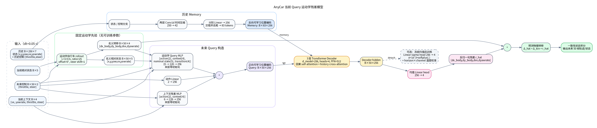
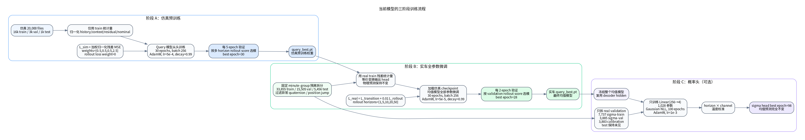

# AnyCar 当前 Query 运动学残差模型与训练方式

代码入口、数据流、checkpoint 字段和部署约束的总览见 [当前确定性 Query 模型、训练与代码功能总览](current_deterministic_query_model_code_guide_20260729.md)。

本文描述本轮对比中“当前模型”的实际结构和训练口径。它不是旧版 6 维 direct `TorchTransformerDecoder`，而是：

```text
TorchTransformerDecoderKinematicQueryMLP
+ 固定运动学自行车 nominal rollout
+ 4 维物理残差预测
+ 默认只输出确定性残差均值
```

**当前运行状态（2026-07-29）**：概率输出已暂停。默认仿真训练和实车微调只运行 `TorchTransformerDecoderKinematicQueryMLP`，输出 `[B,50,4]` 的确定性运动学残差均值，不构造 Sigma、Expected Error 或 Tail Probability Head。概率实验代码和结果仅保留用于离线追溯，只有显式运行概率验证脚本时才会启用。

确定性均值路径仍以本文为准。本文第 4.3 节的 Linear Sigma 是历史概率 baseline，第 4.4 节的 S6-B 是已暂停的离线实验。其结构、三随机种子结果和选择性风险见 [S6-B Layer-Time-Channel Risk Decoder](s6b_layer_time_risk_model_and_validation_20260729.md)。S6-B 未合并进 `models.py`，也不在默认训练或推理链路中。

对应的最终实车均值 checkpoint 为：

```text
outputs/formal_real_finetune_query_baseline_split/20260728T143256/query_best.pt
```

其来源仿真 checkpoint 为：

```text
outputs/formal_kinematic_residual_query_30epoch/20260728T114849/query_best.pt
```

## 1. 模型框图



图中的 Sigma 支路仅用于说明历史实验差异，当前关闭。正常训练和推理只执行均值路径，不加载概率 checkpoint，也不存在 Sigma loss。

## 2. 输入、输出和物理语义

| 项目 | 形状 | 内容 |
| --- | --- | --- |
| 历史输入 | `[B, 250, 7]` | 5 维可观测状态 `[x,y,yaw,vx,yawrate]` + 2 维历史控制 |
| 未来控制 | `[B, 50, 2]` | `[throttle, steer]` |
| 当前上下文 | `[B, 4]` | `[vx, yawrate, current throttle, current steer]` |
| 名义状态 | `[B, 50, 5]` | 固定自行车模型预测的相对 `[x,y,yaw,vx,yawrate]` |
| 名义转移 | `[B, 50, 4]` | `[dx_body,dy_body,dvx,dyawrate]` |
| 网络均值输出 | `[B, 50, 4]` | 归一化后的 4 维运动学残差 |
| 最终状态输出 | `[B, 50, 5]` | 名义转移加残差后，通过一致性积分得到的未来状态 |
| 默认网络输出 | `[B, 50, 4]` | 每个 horizon 的确定性残差均值，不含概率输出 |

采样周期为 `dt=0.05 s`，因此历史覆盖 12.5 秒，预测覆盖 2.5 秒。`vy` 不作为输入或监督目标；`yaw` 不作为独立转移量预测，而是按当前 `yawrate` 积分。

训练目标定义为：

```text
observed transition Δ_obs = [dx_body, dy_body, dvx, dyawrate]
kinematic transition Δ_kin = bicycle_model(state, action)
residual target r = Δ_obs - Δ_kin

r_hat_norm = Transformer(history, action, context, nominal)
r_hat = denormalize(r_hat_norm)
Δ_hat = Δ_kin + r_hat
future_state_hat = consistent_rollout(initial_state, Δ_hat)
```

## 3. 网络内部结构

### 3.1 History memory

状态和历史控制分别通过两层 `Conv1d`，把 250 帧压缩到 42 帧；随后分别映射到 256 维并按时间交错，删除最后一个 token，形成 83 个 history memory tokens。

```text
state history  : Conv1d → ReLU → Conv1d → Linear(5,256)
action history : Conv1d → ReLU → Conv1d → Linear(2,256)
interleave → 83 tokens → flipped learned position embedding
```

### 3.2 Future query

每个未来时刻的 query 是三项之和：

```text
q_t = Linear(action_t)
    + MLP([action_t, current_context])
    + MLP([action_t, current_context, nominal_state_t, nominal_transition_t])
```

- action embedding：`2 → 256`；
- context MLP：`6 → 128 → 256`；
- kinematic query MLP：`15 → 128 → 256`；
- 两个 MLP 的末层均为零初始化，使新增分支初始不破坏已有预测；
- 最后叠加长度 50 的可学习位置编码。

### 3.3 Transformer 和输出

Decoder 使用 3 层、4 个 attention heads、`d_model=256`、FFN 维度 512、dropout 0.1。未来 query 使用 causal mask，并对 83 个历史 tokens 做 cross-attention。

均值输出头为 `Linear(256,4)`。当前配置的可训练参数量是 **2,478,970**；checkpoint 的 state dict 另外含 2,500 个 causal-mask buffer 元素。

### 3.4 与旧 baseline 的关键差异

| 项目 | 旧 direct baseline | 当前 Query 运动学残差模型 |
| --- | --- | --- |
| 预测对象 | 直接预测状态增量 | 预测固定运动学模型的残差 |
| 输出维度 | 6 维，含 `dyaw/dvy` | 4 维 `[dx_body,dy_body,dvx,dyawrate]` |
| `yaw` | 网络直接预测 `dyaw` | 从 `yawrate` 物理一致地积分 |
| `vy` | 有输出但训练权重为 0 | 从协议中移除 |
| future query | 主要由 action embedding 形成 | action + current context + nominal state/transition |
| 物理先验 | 无 | 固定运动学自行车模型 |
| 训练目标 | direct normalized delta MSE | normalized residual MSE，并在实车阶段加入 rollout loss |

## 4. 三阶段训练流程



### 4.1 阶段 A：仿真残差预训练

数据：

```text
/disk/collect_data_from_anycar/New_demo/new_data_with_x_mean_zero/total_data_1
```

正式 run 使用 20,000 个文件，固定种子 3407，拆成 16,000/3,000/1,000 个 train/validation/test 文件。所有 history、context、residual target、nominal state 和 nominal transition 的统计量只从 train 集估计。

转移损失为归一化残差的加权 MSE：

```text
channel = [dx_body, dy_body, dvx, dyawrate]
weight  = [0.5,     0.5,     0.5, 2.5]
L_sim   = L_transition
```

本次仿真训练参数：

| 配置 | 值 |
| --- | ---: |
| Epoch | 30 |
| Batch / eval batch | 256 / 512 |
| Optimizer | AdamW |
| Learning rate | `5e-4` |
| Weight decay | `1e-4` |
| LR decay | 每 epoch 乘 `0.99` |
| Validation | 每 5 epoch |
| Rollout loss weight | `0.0` |
| 选模指标 | validation rollout score |
| Rollout horizons | 1/5/10/20/50 |
| 最佳 epoch | 30 |

虽然仿真阶段没有把 rollout loss 放入反向传播，仍用多 horizon 的物理 rollout score 选择 checkpoint，避免只根据单步归一化 MSE 选模。

### 4.2 阶段 B：实车全参数微调

数据：

```text
/disk/collect_data_from_anycar/data_from_bag/new_temp_data/pkg_file
```

使用固定的 acquisition-minute 隔离拆分：

```text
outputs/splits/session_isolated_real_v1
```

| 集合 | 文件数 | 过滤后窗口数 |
| --- | ---: | ---: |
| Train | 5,720 | 33,855 |
| Validation | 2,628 | 15,505 |
| Test | 918 | 5,456 |

训练前先用 real-train 残差均值和标准差重设输出坐标，并同步变换已有 output head，使变换前后的物理残差预测保持一致。本次 audit 的最大物理输出差为 `5.59e-8`。

随后加载仿真 `query_best.pt`，对均值模型全部参数进行微调：

```text
L_real = L_transition + 0.01 * L_rollout
```

`L_rollout` 在 1/5/10/20/50 步上计算 position、yaw、vx 和 yawrate 误差，并使用 real-train 上固定自行车模型的误差尺度做无量纲化。

| 配置 | 值 |
| --- | ---: |
| Epoch | 30 |
| Batch / eval batch | 256 / 512 |
| Optimizer | AdamW |
| Learning rate | `5e-5` |
| Weight decay | `1e-4` |
| LR decay | 每 epoch 乘 `0.99` |
| Validation | 每 2 epoch |
| Early-stop patience | 5 次 validation |
| 选模指标 | real validation rollout score |
| 最佳 epoch | 28 |

Test 只在选定 checkpoint 后评估。当前实车 Query checkpoint 的全 horizon RMSE 为：position `0.10697 m`、yaw `0.002690 rad`、vx `0.03820 m/s`、yawrate `0.002433 rad/s`。

### 4.3 阶段 C（历史 baseline）：冻结均值模型，训练 Linear Sigma Head

概率模型不是重新训练一个均值网络，而是在同一个 Decoder hidden 上添加：

```text
sigma_norm = 1e-3 + softplus(Linear(hidden_256))
```

均值模型全部冻结并始终处于 `eval()`；只有 `Linear(256,4)` 的 1,028 个参数参与 Gaussian NLL 训练。因此这一阶段不会改变均值预测精度。

实车 validation 文件被进一步按文件顺序隔离为：

| 用途 | 文件数 | 有效窗口数 |
| --- | ---: | ---: |
| sigma head train | 1,314 | 7,737 |
| sigma head validation | 657 | 3,885 |
| temperature calibration | 657 | 3,883 |
| 最终未见 test | 918 | 5,456 |

本次 sigma head 使用 AdamW、`lr=1e-3`、decay 0.99、weight decay `1e-4`，最多 100 epochs；最佳 validation NLL 在 epoch 98。最后用 calibration 集拟合每个 horizon×channel 的温度系数。

需要注意：这个 sigma 表示模型在当前数据分布下学习到的条件残差尺度。它经过校准后可以用于区间覆盖和风险排序，但目前实车 `dx_body` 的校准误差仍较大、误差区分度也非所有通道都强，不能直接视为安全保证。

### 4.4 阶段 C（已暂停的离线实验）：S6-B Risk Head

S6-B 不改变均值预测。它同时读取三层 Decoder hidden `H1/H2/H3`，结合 future action、current context、nominal state 和 nominal transition，为每个 horizon、每个物理通道学习独立的层注意力；随后用两层因果时序块输出：

```text
Gaussian sigma
Expected absolute error
Tail probability
```

训练使用独立的 risk-train/risk-validation/calibration/final-test 拆分；损失由 Gaussian NLL、绝对误差回归、tail BCE 和 pairwise ranking 组成。重点通道 `dy_body/dvx/dyawrate` 上，三随机种子的 Expected Error 聚合结果为 Spearman `0.3449 ± 0.0045`、AUC `0.7528 ± 0.0011`、Recall@10% `0.3698 ± 0.0020`。选择性风险中保留最低风险 50% 样本时，聚合 MAE 降低 `28.1%`。

完整协议和结论边界见 [S6-B 验证报告](s6b_layer_time_risk_model_and_validation_20260729.md)。该 Head 当前关闭，不参与正常训练和推理。

## 5. 复现实验命令

先进入环境：

```bash
source /home/plusai/miniconda3/etc/profile.d/conda.sh
conda activate anycar
cd /home/plusai/anycar
source set_env.sh
```

仿真正式训练：

```bash
python scripts/model_verify/train_kinematic_residual_ablation.py \
  --dataset-path /disk/collect_data_from_anycar/New_demo/new_data_with_x_mean_zero/total_data_1 \
  --max-files 20000 \
  --models query \
  --include-kinematic \
  --epochs 30 \
  --val-every 5 \
  --selection-metric rollout_score \
  --rollout-loss-weight 0.0 \
  --batch-size 256 \
  --eval-batch-size 512 \
  --num-workers 6 \
  --lr 5e-4 \
  --output-dir outputs/formal_kinematic_residual_query_30epoch
```

实车微调：

```bash
python scripts/model_verify/finetune_real_kinematic_residual.py \
  --dataset-path /disk/collect_data_from_anycar/data_from_bag/new_temp_data/pkg_file \
  --split-manifest-dir outputs/splits/session_isolated_real_v1 \
  --residual-checkpoint outputs/formal_kinematic_residual_query_30epoch/20260728T114849/residual_best.pt \
  --query-checkpoint outputs/formal_kinematic_residual_query_30epoch/20260728T114849/query_best.pt \
  --models query \
  --epochs 30 \
  --val-every 2 \
  --batch-size 256 \
  --eval-batch-size 512 \
  --num-workers 4 \
  --lr 5e-5 \
  --rollout-loss-weight 0.01 \
  --output-dir outputs/formal_real_finetune_query_baseline_split
```

当前两个训练脚本默认都只训练 `query` 分支，并在 summary 中写入 `probability_output_enabled: false`。如需复现实验对比，可显式传入 `--models residual,query`；这仍然只比较确定性均值模型，不会启用概率 Head。

## 6. 实现与产物索引

- 模型：`car_foundation/car_foundation/models.py`
- 运动学和残差协议：`car_foundation/car_foundation/kinematic_residual.py`
- 仿真训练：`scripts/model_verify/train_kinematic_residual_ablation.py`
- 实车微调：`scripts/model_verify/finetune_real_kinematic_residual.py`
- 概率 head：`car_foundation/car_foundation/probabilistic_residual.py`
- 概率训练与 sim/real 对比：`scripts/model_verify/analyze_query_probability_shift.py`
- S6-B 风险训练与验证：`scripts/model_verify/verify_real_query_direct_risk_u2.py`
- S6-B sim/real 选择性风险：`scripts/model_verify/plot_s6b_sim_real_selective_risk.py`
- 当前风险模型报告：`car_foundation/docs/s6b_layer_time_risk_model_and_validation_20260729.md`
- 实车训练 summary：`outputs/formal_real_finetune_query_baseline_split/20260728T143256/summary.json`
- 概率训练 summary：`outputs/formal_query_probability_shift/20260728T144804/summary.json`
- S6-B 主 run：`outputs/formal_real_query_layer_time_risk_s6b/20260728T180142`
