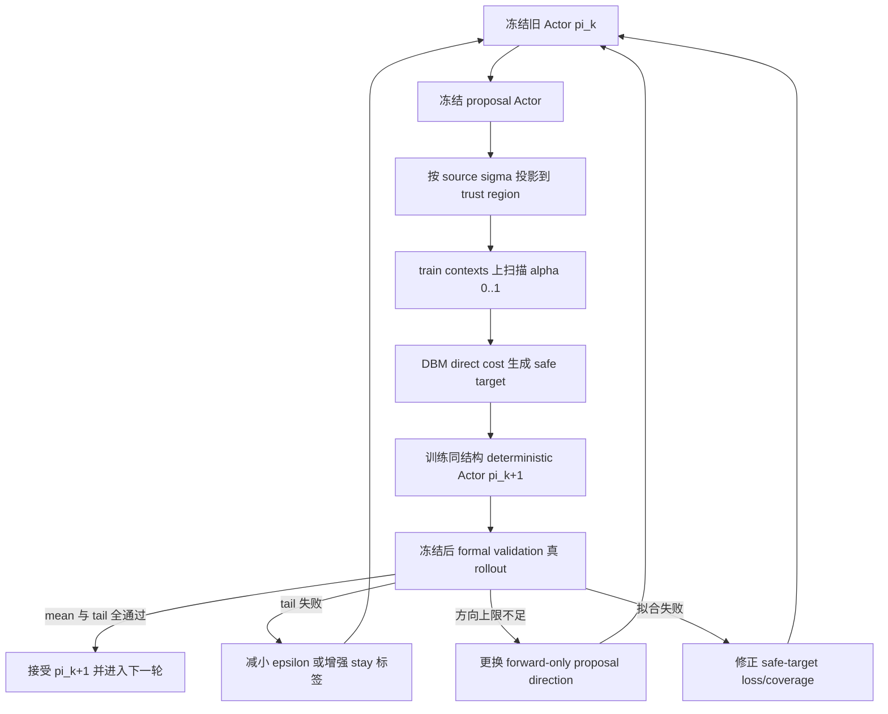

> **[CLOSED-HISTORY 2026-08-20]** 本文档记录的路线已关闭/被取代。权威结论见 `mppi_sampling_center_review_20260812.md` §11.80。本文档不再更新，仅作历史参考。

# MPPI Direct Actor 的 forward-rollout TRPO-like 更新方案

更新时间：2026-08-07

## 1. 决策与目标

当前下一步采用 **forward-rollout deterministic TRPO-like policy iteration**。它保留
TRPO 的核心：冻结旧策略、限制单轮策略变化、line search、真实回报验收；但不恢复随机
Actor，不计算 Fisher/natural gradient，也不使用 DBM 解析梯度。

目标是解决当前 2.4--2.8 m/s 状态中“方向部分正确、固定 full step 过冲、尾部回归”问题。
部署 Actor 仍是 `TorchMPPIDeterministicCenterActor`，每个 context 输出唯一 `[8,2]`
sampling center。训练和推理均不引入 reward seed，未来可把 DBM forward 替换成 Query
PyTorch/ONNX forward。当前 `100 km/h` 扩展继续暂缓，不属于本方案范围。

## 2. 已有证据与进入条件

current Actor 到 cost-sensitive proposal Actor 的 validation 直线扫描显示，固定分组最佳
alpha 随速度从 0.75 降到 0.35；说明统一 full step 不合理。进一步把 alpha=0 放入每个
context 的 0.05 间隔扫描，得到逐状态 line-search oracle：

| reference speed | current cost | line-oracle cost | mean gain | alpha 中位 | 选择 alpha=0 |
| ---: | ---: | ---: | ---: | ---: | ---: |
| 1.2 m/s | 3.059 | 2.420 | 0.639 | 0.75 | 4.2% |
| 1.6 m/s | 5.809 | 4.094 | 1.714 | 0.65 | 15.0% |
| 2.0 m/s | 17.222 | 9.613 | 7.610 | 0.60 | 20.0% |
| 2.4 m/s | 39.528 | 22.569 | 16.959 | 0.40 | 27.5% |
| 2.8 m/s | 61.974 | 31.549 | 30.425 | 0.475 | 20.8% |
| 全部 | 25.518 | 14.049 | 11.469 | 0.60 | 17.5% |

这是 validation 上的诊断上限，不是可部署成绩，也不得作为训练标签。它证明逐状态步长
选择有足够上限，尤其能把 2.8 m/s 降到 warm `48.595` 以下；但仍没有追平 T1/J16，说明
trust step 是当前主要问题之一，而不是剩余问题的全部。

## 3. 与标准 TRPO 的关系

令旧 Actor 和 proposal Actor 输出的中心为：

\[
c_k(s)=\pi_k(s),\qquad \tilde c(s)=\pi_{proposal}(s).
\]

如果训练时把确定性中心解释为固定协方差的辅助高斯策略：

\[
\pi(a|s)=\mathcal N(c(s),\Sigma),
\]

则新旧策略 KL 为：

\[
D_{KL}(\pi_k\|\pi_{k+1})
=\frac{1}{2}(c_{k+1}-c_k)^T\Sigma^{-1}(c_{k+1}-c_k).
\]

因此使用 MPPI source sigma 归一化后的中心距离，等价于固定协方差下的 KL trust-region
代理。当前方案采用更强的**逐 context**约束，而不是只约束 batch 平均 KL。

它不是标准 TRPO：不计算 likelihood ratio、Fisher 矩阵或 natural gradient。Actor 更新
来自 forward rollout 验证后的 safe target，所以更准确的名称是
**forward-rollout trust-region policy iteration（FR-TRPI）**。

## 4. 单轮算法

### 4.1 冻结旧 Actor 与 proposal direction

每轮开始冻结：

- 旧 Actor `pi_k` 及其 normalization/checkpoint hash；
- proposal Actor 或 forward-only direction generator；
- source MPPI sigma、动作边界、8-knot 插值、DBM、cost、horizon 和 episode split。

第一轮固定使用：

- `pi_k`：当前 validation mean `25.518` 的 deterministic Actor；
- `pi_proposal`：`j16_cost_sensitive_expansion_20260807_v2/actor_seed1.pt`；
- 只在 train episodes 生成 safe target；formal validation 只做冻结后的最终 gate。

后续轮次的 proposal 必须来自新 Actor 实际访问中心、forward-only 局部标签或重新训练的
proposal Actor。不得把 DBM 解析梯度作为 proposal 输入。

### 4.2 输出空间 trust projection

对 `[8,2]` center，使用保存的 source MPPI sigma 做归一化：

\[
u(s)=\frac{\tilde c(s)-c_k(s)}{\sigma},\qquad
\rho(s)=\sqrt{\frac{1}{16}\sum_{j=1}^{16}u_j(s)^2}.
\]

将 proposal 限制在半径 epsilon 内：

\[
\bar u(s)=u(s)\min\left(1,\frac{\epsilon}{\rho(s)+10^{-8}}\right).
\]

\[
c(s,\alpha)=\operatorname{clip}
\left(c_k(s)+\alpha\,\sigma\odot\bar u(s),-1,1\right).
\]

初版只在 train-internal split 比较 `epsilon={0.25,0.50,0.75}` sigma-RMS，默认从 0.50
开始。动作 clip 后必须重新保存实际位移和 `rho_realized`；不能假设 clip 前后的 trust
距离相同。

### 4.3 确定性 direct-cost line search

固定：

```text
alpha_grid = 0.00, 0.05, ..., 1.00
```

每个 alpha 只做一次唯一 DBM direct rollout：

\[
J_\alpha(s)=J_{direct}(s,c(s,\alpha)),\qquad
A_\alpha(s)=J_0(s)-J_\alpha(s).
\]

保存两个标签：

1. `argmin_alpha`：纯诊断 oracle；
2. `safe_alpha`：实际训练目标。若最佳改善低于 versioned improvement margin，则为 0；
   否则在接近最佳 cost 的 alpha 中选择最小 alpha，避免在平坦区域走不必要的大步。

初版 conservative tie rule：

\[
\tau(s)=\max(0.05,0.05\,[J_0-J_{best}]),
\]

\[
\alpha_{safe}=\min\{\alpha:
J_\alpha\le J_{best}+\tau,\ J_\alpha<J_0-0.05\}.
\]

集合为空时 `safe_alpha=0`。所有 margin、grid、epsilon 和 tie rule 必须进入 manifest，
只能在 train-internal selection episodes 上选择，不能使用 formal validation 调整。

最终监督目标为：

\[
c_{safe}(s)=c(s,\alpha_{safe}).
\]

### 4.4 训练同结构唯一输出 Actor

`pi_{k+1}` 从 `pi_k` 初始化，不新增 log-std 或运行时 alpha head。推荐第一版不使用 Critic，
直接学习经过真实 forward rollout 验证的 safe target：

\[
L_{target}=w(s)\,\operatorname{Huber}
\left(\frac{\pi_{k+1}(s)-c_{safe}(s)}{\sigma}\right),
\]

\[
L_{trust}=\left[\max(0,\rho(\pi_{k+1},\pi_k)-\epsilon)\right]^2,
\]

\[
L=L_{target}+\lambda_{trust}L_{trust}+\lambda_{bound}L_{bound}.
\]

episode、速度和 scenario 分层保持平衡；`w(s)` 只使用截断后的 verified improvement，
不能让少量高 cost tail 按原始数值无限放大 loss。`safe_alpha=0` 的 context 必须保留，
它们是“保持旧策略”的关键负标签。

训练使用 300 个 train episodes 拟合、60 个 train-internal episodes 选 epoch；选定 epoch 后
可按既有纪律用全部 360 个 train episodes 重拟合一次。formal validation 只能在 Actor
冻结后读取；test episodes 继续封存。

### 4.5 真实 rollout 验收

训练 loss 或 safe-label fit 不能代替 Actor 资格。冻结 `pi_{k+1}` 后，对它的**实际输出**
重新做唯一 DBM direct rollout，并与 `pi_k` 成对比较。不得在 formal validation 上再次做
逐状态 alpha line search、二中心选择或 checkpoint 混合，再把结果称为单 Actor。

单轮接受 gate：

- paired mean gain 的 bootstrap 95% CI 下界大于 0；
- gain median >= 0、P05 >= 0、worst >= -5 cost；
- 2.4/2.8 m/s 和 recovery 分组 mean 均不退化；
- clipping、非有限值和动作边界检查全部通过；
- formal validation 只用于接受/拒绝该冻结轮，不用于修改 alpha/margin/epsilon。

任何一项失败，`pi_{k+1}` 均拒绝，`pi_k` 保持默认。根据归因只允许：减小 epsilon、增加
`safe_alpha=0` 权重、改进 safe-target 拟合，或更换 proposal direction；不得直接进入
Query、ONNX、ROS、四轮搜索或闭环。

## 5. 数据与不可变 sidecar

建议新增：

```text
/disk/collect_data_from_anycar/mppi_rl_closed_loop/labels/
  dbm_direct_trust_region_train_20260807_v1/

outputs/mppi_proposal/
  direct_actor_trust_region_20260807_v1/
```

每个 context 至少保存：

- source snapshot、episode/split、source SHA256；
- old/proposal checkpoint SHA256 和 normalization hash；
- `old_center`、`proposal_center`、`source_sigma`；
- clip 前后 normalized direction、requested/realized trust radius；
- `alpha_grid`、全部 `candidate_center`、`direct_cost` 和 advantage；
- `argmin_alpha`、`safe_alpha`、`safe_center`、margin/tie-rule；
- reference speed、实际 vx、overspeed、heading error、yaw rate、scenario；
- DBM、cost、horizon、插值、动作边界和 repository metadata。

validator 必须独立重构所有 alpha center、重放 direct cost、检查 checkpoint/source hash、
split、有限值、边界和 safe-alpha 规则。原 collection、J16、local-curvature 和 first-pass
context sidecar 不得修改。

第一轮 train 约 6,300 contexts，21 个 alpha，约 132,300 次 deterministic DBM rollout；
formal validation 600 contexts 的诊断/最终复评各约 12,600 次。它远低于历史大规模
MPPI candidate replay，且没有 reward repeats。

## 6. 执行顺序与偏离分支



执行 gate：

1. **TR0 line-oracle gate：**train-internal 及只读 validation 诊断确认逐状态 alpha 有明显
   上限；当前 validation `25.518 -> 14.049`，已满足机制上限。
2. **TR1 sidecar gate：**生成器与独立 validator 100% 通过。
3. **TR2 target-fit gate：**internal heldout 的 safe-target 误差、stay accuracy 和实际
   direct cost 同时通过。
4. **TR3 Actor gate：**formal validation 的 mean/P05/worst/速度/场景全部通过。
5. 只有 TR3 PASS，才允许把新 Actor 作为下一轮 `pi_k`；S3-B、Query/ONNX、ROS 和闭环
   仍服从原权威计划中的后续 gate。

偏离规则：使用 DBM 解析梯度、在 validation 上选择逐状态 alpha、恢复随机 reward、修改
test split，均为 D2--D4，结果作废。perfect-DBM 二中心 guard 可以继续保留为上限，但不能
混入单 Actor 成绩。

## 7. Critic 和真正 TRPO/PPO 的后续位置

第一版不需要 Critic：当前问题先验证“forward-verified 小步目标能否被同结构 Actor 学会”。
如果 TR2 通过但多轮 proposal direction 停滞，再让 Critic只负责产生候选方向或预测
`safe_alpha`，每个新输出仍必须经过真实 forward rollout 后才能成为训练标签。

若以后需要标准 TRPO/PPO，可以在训练期给 deterministic mean 配置固定 covariance，使用
KL 或 likelihood-ratio clip；部署仍取 mean。但这会增加一个不必要的随机策略估计层，
在当前固定状态、确定性 direct reward 问题上不作为优先实现。

## 8. TR1 实际结果（2026-08-07）

TR1 已完成并通过独立验证。不可变 train-only sidecar 位于：

```text
/disk/collect_data_from_anycar/mppi_rl_closed_loop/labels/
  dbm_direct_trust_region_train_20260807_v1/
```

生成与验证入口：

```bash
python scripts/model_verify/generate_dbm_direct_trust_region_labels.py
python scripts/model_verify/validate_dbm_direct_trust_region_labels.py
```

数据合同与规模：

- 360 个训练 episode，按 30 个 stratum 分为 300 个 internal-fit 和 60 个
  internal-selection episode；
- 3,150 个固定快照、每帧 2 个 first-pass context，共 6,300 contexts；
- 每个 context 固定 21 个 alpha，共 132,300 次 deterministic DBM direct rollout；
- 15 个 formal-validation 和 15 个 test episode 只记录为 sealed，未生成标签；
- sidecar 约 57 MiB，包含源/checkpoint 哈希、重建所需元数据和完整 line cost。

train-only 标签的 cost 上限如下；这是 TR2 的监督目标质量，不是训练后 Actor 分数：

| reference speed | old Actor | trusted endpoint | safe label | safe alpha=0 |
| ---: | ---: | ---: | ---: | ---: |
| 1.2 m/s | 2.586 | - | 2.147 | 11.6% |
| 1.6 m/s | 5.535 | - | 3.780 | 8.3% |
| 2.0 m/s | 13.355 | - | 8.022 | 8.7% |
| 2.4 m/s | 26.838 | - | 16.344 | 13.7% |
| 2.8 m/s | 48.740 | - | 31.432 | 14.8% |
| all | 19.411 | 14.051 | 12.345 | 11.4% |

全量独立 validator 从源 snapshot 和冻结 checkpoint 重新构造 Actor 输入、trust line、21 个
center 及 DBM cost，结果为：

```text
validated_snapshots: 3150
validated_contexts: 6300
maximum_center_error: 0.0
maximum_cost_error: 0.0
maximum_metadata_error: 5.914336043133517e-07
sealed_episode_count: 30
qualification: TR1_VALIDATED
```

因此当前 gate 更新为：

```text
TR0 line-oracle gate: PASS
TR1 immutable sidecar + validator: PASS
TR2 safe-target Actor fit: FAIL
TR3 formal validation Actor gate: PENDING
```

TR2 只能使用 `internal_fit` 更新参数，`internal_selection` 用于选 epoch/超参；formal
validation 仍不得参与拟合或选择。TR2 应先验证同结构 Actor 能否逼近 `safe_center`、识别
stay 标签，并用唯一 direct output 降低 internal-selection DBM cost；未通过前不得打开 TR3。

## 9. TR2 实际结果（2026-08-10）

同结构 511,120 参数 Actor 的首轮 safe-target 拟合已经完成，但 **TR2 FAIL**，因此未打开
formal validation。正式产物：

```text
scripts/model_verify/train_mppi_direct_trust_region_actor.py
scripts/model_verify/validate_mppi_direct_trust_region_actor.py
outputs/mppi_proposal/direct_actor_trust_region_20260807_v1/
  selection_actor_seed{0,1,2}.pt
  direct_actor_trust_region_selected.pt
  training_summary.json
  tr2_validation.json
```

训练只用 300 internal-fit episode，60 internal-selection episode 选择 seed/epoch；3 seeds
均跑满 200 epochs，学习率 `1e-4 -> 1e-6`，epoch 0 始终参与竞争。选中 seed 0、epoch
135；随后按冻结纪律在全部 360 train episode 重拟合 135 epochs。formal validation 和
test 从未加载。

internal-selection 的冻结结果：

| 指标 | old Actor | safe label | learned Actor |
| --- | ---: | ---: | ---: |
| mean direct cost | 25.355 | 14.316 | 22.680 |
| mean gain vs old | 0 | 11.039 | 2.676 |
| target sigma RMSE | 0.417 | 0 | 0.264 |
| gain median / P05 / worst | 0 / 0 / 0 | nonnegative | 0.448 / -11.636 / -294.542 |
| safe-alpha-zero recall | 100% at epoch 0 | 100% target | 0% |
| trust-radius violation | 0% | 0% | 3.33% |

各速度 mean gain 均为正（1.2--2.8 m/s 为
`0.180/1.226/1.616/5.698/4.659`），但 P05 从 `-0.500` 恶化到
`-25.121/-22.402`，高速 worst 为 `-57.015/-294.542`。因此不能用平均 cost 改善掩盖
尾部失败。

两个 train-internal 诊断进一步排除了简单超参解释：

1. `safe_alpha=0` 权重从 2 提到 8/32 时，stay recall 可从 0 提到约 3%/58%，P05 改善
   到约 `-3.69/-3.40`，但 mean/target 拟合下降且 worst 仍为 `-74.8/-129.0`；继续单纯
   加权没有解决尾部。
2. 在 internal-selection 上把旧 Actor 与 seed-0 selection Actor 的参数差扫描
   `alpha=0:0.05:1`：`alpha=0.05` 已有 mean gain `+0.306`，但 worst `-10.882`；所有
   非零 alpha 都无法满足 worst `>=-5`，只有 alpha 0 回退通过 tail 条件。

独立 validator 重放 6,300 contexts，旧 Actor center 最大误差 `1.08e-7`，selected/final
摘要指标最大误差均为 0，checkpoint SHA256 为
`7936e85fcdc422eb9416f3547ee47f1bcefc4cc7c6465b5e26d245ef7f91b26f`。资格为：

```text
TR2_FAIL_STAY_TRUST_AND_TAIL
```

结论不是“没有学到任何东西”：mean 和 target fit 明显改善；失败在于同一个连续回归头
把绝大多数 context 都向前移动，不能可靠表达逐状态 stay，并且少量高敏感状态对任何
共享非零参数步都产生大回归。TR3 继续封存。下一分支不能再盲调 MSE/epoch/stay weight；
需要先明确授权选择下列之一：

- **显式 state-conditioned scalar alpha/stay gate：**冻结 old/proposal direction，只学习
  `alpha in [0,1]` 与 stay，输出仍是唯一 deterministic center；
- **verified two-center fallback：**运行时分别 direct-rollout old/new center 后取较低者，
  DBM 可作为上限，Query 阶段必须先通过 pairwise ranking；
- 更换 proposal direction，并从 TR1 重新生成 forward-verified 标签。

## 10. TR2-B alpha/stay gate（2026-08-10）

为尽快进入 Actor--Critic，同时避免 TR2 的 16 维回归尾部，新增显式 deterministic
move/stay + continuous-alpha policy：

```text
TorchMPPITrustAlphaPolicy
scripts/model_verify/train_mppi_direct_trust_alpha_policy.py
scripts/model_verify/calibrate_validate_mppi_direct_trust_alpha_policy.py
outputs/mppi_proposal/direct_trust_alpha_policy_20260810_v1/
```

它冻结 old/proposal Actor 和 TR1 的 projected trust direction；网络输入增加 16 维方向、
requested rho 和 trust scale，输出 move probability 与条件 `alpha in [0,1]`。推理时
`p(move)<=threshold` 精确输出 alpha 0，否则输出连续 alpha；最终 center 仍唯一且不使用
DBM 梯度。

3 seeds、150 epochs 仅用 internal-fit，internal-selection 选中 seed 2 / epoch 35。
未校准 threshold 0.5 的 mean cost 为 `25.355 -> 14.855`，safe label 为 `14.316`，即恢复
约 95.1% 的标签 mean gain；P05 为 0，但 worst 为 `-36.126`。因此只在
internal-selection 扫描固定 deployment threshold，并冻结 fit-only checkpoint，不使用
已经看过 selection 的 all-train refit。

选中 threshold `0.99` 后：

| metric | value |
| --- | ---: |
| old / policy / safe mean cost | 25.355 / 21.522 / 14.316 |
| mean / median / P05 / worst gain | 3.834 / 0 / 0 / -3.538 |
| move fraction | 12.67% |
| regression fraction | 0.17% |
| stay recall / move precision | 96.77% / 98.68% |

1.2--2.8 m/s 的 mean gain 为 `0/0.185/0.888/4.252/13.843`，全部不退化；只有一个
context 退化，且 worst 高于 `-5`。冻结产物：

```text
trust_alpha_policy_tail_calibrated.pt
tr2b_validation.json
qualification: TR2B_PASS_ALPHA_AC_READY
```

这只通过 train-domain 初始化/安全门，不是 formal-validation 或部署资格。下一步允许直接
训练 **Alpha Actor--Critic**：动作是连续 alpha，Critic 使用 TR1 的
`reward=old_cost-direct_cost(alpha)`。internal-fit 有 `5700*21=119700` 条完整一维动作
样本，internal-selection 有 `600*21=12600` 条，只用于 Critic/Actor 选择；formal
validation/test 继续封存。Alpha AC 通过后再决定是否扩大到完整 16 维 residual AC。

## 11. Alpha Actor--Critic train-domain 结果（2026-08-10）

一维连续 Actor--Critic 已完成：

```text
TorchMPPITrustAlphaCritic
scripts/model_verify/train_mppi_direct_alpha_actor_critic.py
scripts/model_verify/validate_mppi_direct_alpha_actor_critic.py
outputs/mppi_proposal/direct_alpha_actor_critic_20260810_v1/
```

这是固定状态 contextual bandit，不是车辆 transition SAC。双 Critic 仅使用 119,700 条
internal-fit line action，拟合
`asinh((old_cost-direct_cost)/5)`。Actor 从校准 TR2-B 初始化，通过双 Critic 的保守
最小值更新。由于 0.99 move/stay 边界不可微，policy improvement 还使用 Critic 在已
覆盖 21 点 alpha 网格上的 argmax 监督 move/stay；不使用 safe-alpha teacher 标签或
DBM 解析梯度。epoch 0 参加选择，每个候选 epoch 都用 internal-selection 重新校准
deployment threshold。

3 seeds 选中 seed 0、Critic epoch 40、Actor epoch 5 和 threshold 0.88：

| metric | TR2-B | Alpha AC |
| --- | ---: | ---: |
| mean direct cost | 21.522 | **20.696** |
| mean gain vs old | 3.834 | **4.660** |
| median / P05 / worst gain | 0 / 0 / -3.538 | **0 / 0 / -3.537** |
| move fraction | 12.67% | 20.33% |
| stay recall / move precision | 96.77% / 98.68% | 96.77% / 99.18% |

Alpha AC 恢复 train-domain safe-label gain 的 42.2%，TR2-B 为 34.7%。五档速度 mean
gain 为 `0.043/0.427/2.033/6.043/14.753`，均不退化。独立加载与 direct DBM 重放和
保存指标完全一致，资格为 `ALPHA_AC_VALIDATED_READY_FOR_FORMAL_GATE`。

剩余限制也很明确：Critic 相邻方向符号准确率 90.30%、grid argmax exact 58.83%，但
mean argmax regret 为 1.612，仍存在一个罕见灾难性 Critic 选择。因此禁止把 Critic
直接作为无门控在线 argmax；当前 Actor 的 hard fallback 和 threshold 是模型的一部分。
下一步是 formal-validation TR3。test、Query、ONNX、ROS、fixed-MPPI wrapper 和闭环
继续封存。

## 12. TR3 formal-validation 冻结协议（执行前，2026-08-10）

在读取 formal validation 前冻结以下内容：

- Alpha AC checkpoint SHA256：
  `ae862c09e09a46929e7cd172f54f2c2821cf6f20ba18ee7bef7b086c31ef9783`；
- TR2-B checkpoint SHA256：
  `37cd09ab746f28fa7c3acf512e7f993d675ebc16b29104ba1f65e23497e5f012`；
- Alpha AC move threshold 固定为 `0.88`，TR2-B 固定为 `0.99`，TR3 不再调参；
- 只读取 `episode_090--104` 的 15 个 validation episodes，共 300 snapshots、600
  first-pass contexts；`episode_105--119` test 保持未读；
- source scenario-plan SHA256：
  `0c32a8f61fc5d81eb0ca76e0df1904b876c16364fce6dd44d0899019c895a8f2`；
- feedback/risk summary SHA256：
  `421a80905229d31344fd142dd4695f2e178dc26053be2740ab80ac81b1995f4a` / 
  `681813b14ab678ecf5c95ae777849400fc6dea2393c03cf9f27285e76338be47`；
- fixed DBM、0.21 m small-car、direct 50-step cost、old/proposal direction、0.5-sigma
  trust projection全部不变；不使用 DBM 解析梯度。

TR3 同时报告 old Actor、TR2-B、Alpha AC 和 validation line oracle。预先冻结的门槛：

1. Alpha AC 相对 old Actor 的 paired mean gain 95% episode-bootstrap CI 下界 `>0`，
   median/P05 `>=0`，worst `>=-5`；
2. 2.4/2.8 m/s 与 heldout-recovery 相对 old Actor的 mean gain 均 `>=0`；
3. Alpha AC 相对 TR2-B 的 paired mean gain `>0` 且 95% episode-bootstrap CI 下界
   `>0`，否则只能保留 TR2-B，不能宣称 AC 泛化改善；
4. checkpoint、输入重构和 direct DBM cost 必须由独立 evaluator 复算一致；
5. 本轮不因结果重新校准 threshold、重选 epoch/seed 或追加 validation 训练。偏离为 D0
   才有效；任何 validation 调参为 D2-invalid。

TR3 PASS 只允许规划后续固定 DBM 短闭环 A/B；它不自动打开 test、Query/ONNX、ROS
或部署资格。

## 13. TR3 formal-validation 结果与失败分支（2026-08-10）

TR3 按第 12 节冻结协议执行，偏离等级 `D0`。只读取 validation episodes 090--104；
threshold、seed、epoch 均未调整，test 105--119 未打开。正式结果：

| 方法 | mean direct cost |
| --- | ---: |
| old Actor | 25.518 |
| TR2-B | 23.541 |
| Alpha AC | **23.470** |
| safe line label | 18.259 |
| argmin line oracle | 17.997 |

Alpha AC 相对 old 的 mean gain 为 `2.049`，15-episode bootstrap 95% CI 为
`[0.376,4.401]`；但 median/P05/worst 为 `0/0/-75.937`，27/600 contexts 退化，17 个
低于 -5。因此主 tail gate 失败。相对 TR2-B 的 mean gain 仅 `0.071`，95% CI
`[-0.299,0.390]`，增量泛化也未通过。2.4/2.8 m/s 的 mean gain 相对 old 为
`2.053/7.689`，但 2.4 m/s P05 为 `-11.778`；不能用分组均值掩盖尾部。

独立 validator 对 old/proposal/direction/line、两策略 probability/alpha/center 和全部
direct cost 的最大误差都是 0，summary 指标误差也是 0。资格：

```text
TR3_FAIL_RETAIN_TR2B_OR_OLD
TR3_INDEPENDENTLY_VALIDATED
```

进一步 tail 诊断说明 TR2-B 本身也未通过 formal tail：mean gain `1.977`，worst
`-55.249`，16 个退化、10 个低于 -5。Alpha AC 有 104 个 move，其中 17 个真实
safe-alpha=0，17 个全部退化；move conditional-alpha 中位数约 `0.999`。两策略实际上
接近“stay 或 endpoint”二分类，没有学成稳定的连续安全步长。最坏 Alpha AC context 是
`episode_100/step_000322/context_1`，2.4 m/s heldout-mixed，old/AC cost
`38.280/114.217`，formal line oracle 明确选择 alpha 0。

因此 standalone 正式默认回到 old Actor，不能部署 TR2-B 或 Alpha AC。formal
validation 已用于本次诊断，后续模型不得再以同一集合调 threshold/checkpoint 或声称无偏
qualification。冻结失败分支：

1. 回到 119,700 条 train-only line replay，显式构造 endpoint-regression、safe-alpha=0
   和 maximum-safe-alpha/tail 标签；高速度/恢复 hard negative 做 episode-balanced
   过采样；
2. Actor 输出仍为连续 alpha，但由 risk/upper-bound head 限制最大步长，不再允许
   conditional alpha 自动饱和到 1；保留 exact stay fallback；
3. internal-fit/internal-selection 继续隔离，并增加 train-only episode cross-fitting，禁止
   使用 formal validation 反向训练；
4. 在模型冻结前采集一批全新 validation-like episodes 作为下一次无偏 gate；现有 test
   105--119 继续留到最终一次；
5. 在新 gate 通过前，不做 DBM 闭环、Query/ONNX、ROS 或完整 16-D AC。

## 14. TR3 的 27 个回退上下文独立诊断（2026-08-10）

已将 27/600 个 Alpha AC 回退上下文从正式验证结果中单独导出，并保留完整 line-cost、
策略输出、首轮响应统计、学习表示及 train-only 最近邻：

```text
scripts/model_verify/analyze_mppi_direct_alpha_ac_regressions.py
outputs/mppi_proposal/direct_alpha_ac_tr3_validation_20260810_v1/regression_contexts.csv
outputs/mppi_proposal/direct_alpha_ac_tr3_validation_20260810_v1/regression_contexts.npz
outputs/mppi_proposal/direct_alpha_ac_tr3_validation_20260810_v1/regression_analysis.json
outputs/mppi_proposal/direct_alpha_ac_tr3_validation_20260810_v1/regression_analysis.md
outputs/mppi_proposal/direct_alpha_ac_tr3_validation_20260810_v1/regression_analysis.png
```

27 个错误全部是步长决策错误：17 个真实 safe-alpha 为 0，另外 10 个只允许
`0.05--0.35` 的小步；策略实际 alpha 均在 `0.994--1.000`。因此当前连续 Actor 在 move
以后仍近似退化为 endpoint，不具备风险自适应缩步能力。

错误不是均匀分布。1.2/1.6 m/s 均为 0，2.0/2.4/2.8 m/s 分别有 7/16/4 个；其中
22 个集中在 episode 096/099/100/101。2.4 m/s 正式验证的 safe-zero 占比为 34.2%，
而 internal-fit/internal-selection 分别只有 14.1%/9.2%。全速度汇总也从 12.0%/5.2%
升到 formal validation 的 23.0%，说明用于 threshold/epoch 选择的内部集合明显偏容易。

23 个独立故障快照中，4 个快照的两个 first-pass context 都错，19 个只错一个。对这 19
个同状态配对，projected direction 余弦相似度中位数为 0.969；坏方向 endpoint gain
中位数为 -8.968，非回退配对方向为 +0.996。策略却对坏方向给出更高的平均 move
probability（0.913 对 0.889）。这排除了“只由物理状态 OOD 引起”的简单解释，证明网络
没有分辨相近方向下可能翻转的局部 cost 响应。

学习 embedding 的最近邻距离只比其余上下文略大（中位数 0.357 对 0.313），不能把这
27 个简单判为远距离 OOD。更关键的是其最近 5 个 train-only 近邻 safe-alpha 均值的
中位数为 0.920，而真实 safe-alpha 中位数为 0；同时首轮 response fit error 中位数从
非回退的 0.395 增至 0.500。即当前表示把高风险 validation response 映射到训练集中的
大步安全区域，属于局部响应覆盖不足加表示混叠，门控也没有使用拟合不可靠性做保守决策。

因此根因优先级为：训练/校准 hard-negative 分布不足；局部 cost-response 表示分辨率不够；
conditional alpha 饱和使门控误判直接变成 full-step tail。它不是单纯网络宽度不足，也不应
靠在已打开的 formal validation 上重新调高 threshold 修补。下一版应只用 train-only
新场景生成 2.0--2.8 m/s 的成对 hard negative，显式训练 safe-step upper bound 或
cost-increase lower-confidence-bound，并建立难度匹配且 episode-disjoint 的新内部校准集。
现有 formal validation 只保留作诊断，test 105--119 继续封存。

## 15. 持续交互单步 Alpha SAC 机制（2026-08-10）

原 Alpha AC 的 Critic 先离线训练、再在 Actor 阶段冻结，只能检验固定 Q 是否提供可用
梯度，不能让 Actor 新动作的 DBM 反馈反向修正 Critic。现已实现真正的 train-only
持续交互版本：

```text
TorchMPPITrustAlphaSACPolicy
scripts/model_verify/train_mppi_direct_alpha_online_sac.py
scripts/model_verify/validate_mppi_direct_alpha_online_sac.py
```

任务仍是单步 terminal contextual bandit，而不是车辆 next-state MDP。Actor 是 hybrid
SAC：stay/move Bernoulli 分支在 loss 中精确枚举，move 分支使用可重参数化 logit-normal
连续 alpha；训练期采样不进入部署接口，推理仍以固定 threshold 和分布均值输出唯一
alpha/center。每个新动作通过一次 forward-only DBM direct rollout 得到
`reward=old_cost-direct_cost`，写入 actor-visited Replay Buffer，然后主双 Critic 与 Actor
交替更新。transition 为 terminal，所以 `Q(s,alpha)=reward`，无需 target Critic 做 Bellman
bootstrap；但主 Critic 始终更新，不再冻结。训练批次固定混合原 21 点 TR1 grid 和在线
replay，防止新策略窄分布覆盖掉完整 alpha 曲线。

首轮较完整的 train-only 运行是：

```text
outputs/mppi_proposal/direct_alpha_online_sac_trainonly_20260810_v1
```

20 轮共加入 25,600 条 actor-visited transitions，覆盖全部 300 个 internal-fit episodes；
8.04% reward 为负。internal-selection 不进入 replay，只选择 checkpoint；formal validation
090--104 和 test 105--119 均未读取。结果：

| metric | frozen-Critic Alpha AC | online Alpha SAC v1 |
| --- | ---: | ---: |
| internal-selection mean cost | 20.696 | **20.180** |
| mean gain vs old | 4.660 | **5.175** |
| P05 / worst gain | 0 / -3.537 | **0 / -3.537** |
| move fraction | 20.33% | 24.50% |
| selected iteration / replay size | 0 / 0 | 20 / 25,600 |

五档速度 mean gain 为 `0.047/0.758/2.697/7.180/15.193`，均非负。独立 validator
重新计算全部 25,600 条 replay direct reward、selected policy 和 Critic 指标，最大误差
全部为 0；replay 覆盖 300 个 fit episodes，与 internal-selection 交集为空，资格为
`ONLINE_ALPHA_SAC_INDEPENDENTLY_VALIDATED`。

v1 产生后 trainer 又加入了 v2/v3 的 delta/sign-loss 试验开关。v1 的精确重现参数已固定
在该输出目录的 `README.md`：将 delta/sign 权重置 0、negative loss 置 1、Actor 每次更新
采一个 conditional alpha；不能直接用后续默认参数冒充 v1。

该结果只证明持续交互管线和平均改善成立，不证明已解决 TR3 尾部。v1 的新 batch
transformed-reward RMSE 平均从 0.380 降到 0.372，但负 reward 符号准确率约 35%，且
selected hard-alpha mean 0.244 与 move fraction 0.245 几乎相同，说明 move 后 alpha 仍
接近 1。强化负样本的 v2 将新负样本符号准确率从 67.2% 提高到 70.4%，但破坏完整 grid
排序，internal-selection cost 只到 20.691；折中 v3 cost 20.614，仍不如 v1。这说明
持续更新 Critic 是必要条件，但不是充分条件：负样本校准与全曲线保持存在明显冲突，且旧
conditional-alpha sigmoid 已经饱和。

另做了不改变动作范围的 alpha-logit 去饱和 v4（固定 scale 0.7）。它从自身初值
20.712 改善到 20.480，但仍差于 v1 的 20.180；selected hard-alpha/move fraction 为
0.2268/0.2283，条件步长均值仍约 0.993。独立重放误差仍为 0。固定缩放只能改善梯度，
没有让策略学出真正的 context-dependent 小步，因此不选 v4。

当前状态为 **online single-step SAC mechanism PASS / continuous shrink and formal tail
PENDING**。v1 可作为后续研究 checkpoint，不能部署，也不能重新使用已经消费的 formal
validation 调参。下一步只在 train-only 上处理两点：采用 separated base/online Critic
loss 或显式 delta/sign head，在保持 21 点 grid 排序的同时提高 actor-visited negative
识别；对连续 alpha 使用去饱和参数化并验证 Actor 确实输出 `0<alpha<1`，而不是仅改变
move gate。冻结新 checkpoint 后必须另采未见 validation-like episodes；现有 test 继续
封存。

## 16. 持续更新与 teacher 上限复核（2026-08-10）

为避免把不同搜索目标混为一谈，本轮把 teacher 固定为当前 scalar-alpha 动作契约中的
train-only conservative safe-alpha label；同一冻结方向上的 21 点逐状态 argmin 作为动作
空间上限。internal-selection 的 old/safe/line-argmin mean cost 分别为
`25.355/14.316/13.920`。safe teacher 距离 line argmin 平均只有 `0.396`，所以超越 safe
teacher 的最大空间很小；更早 T1/J16 teacher 属于不同候选空间，不作为本轮是否超越的
同口径判据。

trainer 已支持 `--resume-run`：恢复 online Actor、主双 Critic 和 actor-visited replay，
新 checkpoint 还保存 Actor/Critic optimizer state。旧 v1 没有 optimizer state，因此第一
段续训只恢复网络和 25,600 条 replay，Adam 动量重新建立；第二段从新 checkpoint 连同
optimizer state 完整恢复。两段均只与 internal-fit DBM 交互，internal-selection 只选
checkpoint，formal validation/test 没有读取。

完整链为初始 20 轮、续训 80 轮、完整状态续训 40 轮；replay 最终为 179,200 条。最佳
checkpoint 出现在全局 iteration 48：

| metric | online v1 @20 | continued best @48 | safe teacher | line argmin |
| --- | ---: | ---: | ---: | ---: |
| mean direct cost | 20.180 | **19.721** | 14.316 | 13.920 |
| mean gap to safe teacher | 5.864 | **5.405** | 0 | -0.396 |
| move fraction | 24.50% | **27.00%** | 94.83% | 95.83% |
| safe-teacher beaten contexts | 21.00% | **23.33%** | -- | -- |
| P05 / worst gain vs old | 0 / -3.537 | 0 / -3.537 | -- | -- |

第二段额外 40 轮未刷新 iteration 48，说明不是简单的训练轮数或 optimizer 动量问题。
内部安全阈值随 Actor 更新从 0.90 升到 0.94--0.99，抵消了 raw move probability 的提高。
Critic 的完整 line adjacent-sign accuracy 从 v1 的 0.870 降到 0.866，argmax regret 从
1.794 增至 1.883，也没有显示出更可靠的 risk 排序。

对 iteration-48 Actor 做只读 threshold sweep 时，放宽到 threshold 0.18 可得到 mean
cost `14.536`，只比 safe teacher 差 `0.220`；但 regression fraction 为 4.67%，worst
gain 为 `-39.334`，不满足安全门。safe-move 与 safe-stay 的 move probability 分布严重
重叠，后者中位数仍为 0.765。结论是连续中心的平均质量已接近 teacher，真正瓶颈是
`Q(move)-Q(stay)`/风险排序与尾部校准；继续同配置堆迭代不会可靠超越 teacher。下一步
应在 train-only 上显式学习 move-vs-stay delta/risk（分离 base-grid value 与在线 delta
loss，或增加 conservative lower-bound head），同时保持 Actor/Critic 持续更新。不能靠
降低 threshold 获得一个表面上的均值改善，也不能复用已消费的 formal validation 调参。

冻结研究输出：

```text
outputs/mppi_proposal/direct_alpha_online_sac_continued_20260810_v1
outputs/mppi_proposal/direct_alpha_online_sac_continued_20260810_v2
```

两个输出都通过 independent direct-DBM replay；v2 对全部 179,200 条 replay reward、
policy metrics 和 Critic metrics 的最大复算误差均为 0，selection replay overlap 为空。

## 17. 训练探索与部署安全解耦（2026-08-11）

根据新的训练原则，online Alpha SAC 增加 `selection_mode=aggressive_mean`。该模式仍从
预训练 Actor/Critic 开始并保留 `alpha in [0,1]`、reward asinh、twin-Q minimum、梯度
裁剪、21 点 base replay 和 finite-value 检查，但训练采集/checkpoint 选择不再要求
P05 非负、worst 大于 -5 或 stay recall。每个 cost 增加的动作仍写入 replay，让 Critic
学习负 reward；internal-selection 只按 mean direct cost 选择研究 checkpoint。旧
`safe_gate` 模式保持兼容，安全 threshold 只作为 post-hoc 指标。

同时修正持续训练状态语义：最低 mean-cost Actor 保存为
`online_alpha_sac_selected.pt`，最新 Actor/Critic/optimizer 保存为
`online_alpha_sac_training_state.pt`。`--resume-run` 优先加载后者，避免在 Actor 未刷新
best 时把已经更新的 Critic 一起回退。

冻结 train-only 运行：

```text
outputs/mppi_proposal/direct_alpha_online_sac_aggressive_20260811_v2
```

它从 aggressive mean cost `14.536`、threshold 0.18、move fraction 97.83% 开始，继续
80 轮；replay 达到 200,000 容量，负 reward 比例由约 8.61% 升至 10.31%。网络没有
NaN、动作越界或参数爆炸，但后续 Actor 没有刷新起点，iteration 220 为 `14.586`；因此
仍未超过 matched safe teacher `14.316`，line argmin 为 `13.920`。selected Actor 的
post-hoc safe cost 仍是 `19.721`。

移除安全 gate 后仍未改善，说明它不再是训练阻点。最新 Critic 的 full-line adjacent-sign
accuracy 从 0.8662 降到 0.8455，mean argmax regret 从 1.8835 升到 2.1254，Actor cost
则随更新缓慢上升。下一步必须继续保持 aggressive 训练口径，但修复 Critic 的排序遗忘：
将 immutable 21-point base-grid value/rank loss 与 actor-visited online delta loss 分开
计算和配权，按 base rank 与 online reward 两套指标选择 Critic；不能重新引入训练期
安全 threshold 掩盖这个问题。

独立 validator 对 200,000 条 replay reward、selected/latest policy、selected/latest
Critic 的复算误差均在容差内，selection replay overlap 为空；formal validation/test
仍未读取。

## 18. 分离 Critic loss 与纯均值 Actor 更新（2026-08-11）

为处理 aggressive run 中的 Critic 排序漂移，trainer 增加
`critic_objective=separated_curve`：每次 Critic update 分别计算完整 21 点 base curve 的
value/adjacent-delta/alpha-zero anchor loss，以及 actor-visited replay 的 value/
`Q(alpha)-Q(0)` delta loss，二者独立归一化和加权。另增加 Critic-only warm-up、每10轮
完整 line rank 诊断、`resume_checkpoint_role`，以及
`critic_trainable_scope=action_heads`；后者冻结 context/direction/state-fusion，只更新
alpha encoder 和 Q head。

全 Critic 更新的 separated v1 仍发生 heldout rank 漂移：adjacent-sign 最终 0.8357、
argmax regret 2.2616。冻结表示的 v2 将最终值改善至 0.8566/1.9361，但 Actor cost 仍从
14.5358 变差至 14.5610。原因是 Actor loss 仍包含 twin-Q disagreement penalty 和 entropy
项，它们在当前近 teacher、外部已有 policy/uniform exploration 的设置下形成保守偏置。

v3 将 disagreement、gate entropy 和 alpha entropy 权重置零；探索仍由每个 context 的
两条 stochastic policy action 和一条 uniform alpha 提供。10轮 Critic warm-up 后，Actor
cost 持续从 `14.535789` 降至 `14.519229`，v4 继续到 `14.518854` 后回升，因此保留
iteration 278。后续检查发现 resume 时 `optimizer.load_state_dict()` 会恢复旧 param-group
超参，覆盖命令行学习率；所以 v3/v4 实际都使用 Actor LR `1e-5`、Critic LR `5e-5`。
此前将二者解释为 `5e-6 -> 1e-5` 学习率对比是错误的，数值结果本身仍有效，但只能视为
同一有效学习率下的继续训练。trainer 已在恢复 optimizer 后重新应用显式 CLI 学习率，
并将 effective learning rate 写入 summary/checkpoint：

| metric | aggressive start | separated best v4 | safe teacher | line argmin |
| --- | ---: | ---: | ---: | ---: |
| mean direct cost | 14.535789 | **14.518854** | 14.316077 | 13.920438 |
| gap to safe teacher | 0.219713 | **0.202778** | 0 | -0.395639 |
| teacher-beaten context fraction | 69.67% | **72.00%** | -- | -- |
| move fraction | 97.83% | 97.67% | 94.83% | 95.83% |

这证明训练/部署安全解耦和去除保守 Actor bias 的方向有效，但改善只有 0.01694，尚未
超越 teacher。v4 post-hoc safe threshold 为 0.99、cost 21.226，部署安全分支没有同步
改善，符合本阶段只验证开放训练的范围。

权威输出：

```text
outputs/mppi_proposal/direct_alpha_online_sac_aggressive_separated_20260811_v4
```

独立 validator 对 200,000 条 replay、selected/latest Actor 与 Critic 指标的最大误差均
在容差内，无 selection replay 泄漏，formal validation/test 未读取。当前下一阻点不是
安全门；是否只是 Critic 训练不足需要用固定 replay、冻结 Actor 的 Critic-only 实验
隔离验证，不能由联合训练曲线直接判断。

## 19. 固定 replay 的 Critic-only 隔离验证（2026-08-11）

为验证“Actor 不再改善是否仅因为 Critic 训练不够”，在线 trainer 增加
`training_mode=critic_only` 和 `--no-collect-transitions`。实验从 v4 selected checkpoint
恢复，冻结 Actor、固定同一 200,000 条 replay、禁止新增 DBM transition，只更新 Critic
的 alpha encoder 与 Q head。每轮做 40 次 Critic minibatch update，共 60 轮，即每档
2,400 次更新；分别测试有效 Critic LR `1e-5` 和 `3e-6`。Critic checkpoint 不按训练
loss，而按 600 个内部 selection context 的完整 21 点 line 指标选择：

`selection_score = mean(argmax regret) + 0.1 * transformed-reward RMSE`，越低越好。

| run | 初始 score | 全程最好 score | 末轮 score | 初始/末轮 RMSE | 初始/末轮 sign acc. | 初始/末轮 argmax regret | 前10/后10轮 loss |
| --- | ---: | ---: | ---: | ---: | ---: | ---: | ---: |
| LR `1e-5` | **2.00051** | **2.00051** | 2.02108 | 0.83363 / 0.83442 | 86.04% / 85.61% | 1.91714 / 1.93763 | 0.81287 / 0.81649 |
| LR `3e-6` | **2.00051** | **2.00051** | 2.01751 | 0.83363 / 0.83455 | 86.04% / 85.65% | 1.91714 / 1.93406 | 0.81292 / 0.81697 |

两档 selected Critic 都保留 iteration 330 的起点，qualification 均为
`ONLINE_ALPHA_CRITIC_ONLY_RANK_PLATEAU`。冻结 Actor 的 mean cost 在全过程严格保持
`14.518854`，所以结果未被策略漂移混淆。较低 LR 只略微减小退化，2,400 次更新没有产生
任何 selection-rank 改善，minibatch loss 也没有下降趋势。因此当前证据反对“只差更多
Critic update”这一单因解释；瓶颈更可能是固定 replay 与现有 loss 对策略所需局部导数的
信息/目标不匹配。下一步应在 Actor 当前 alpha 两侧采集成对局部 probe，直接增强局部
顺序和差分监督，再重复同一 Critic-only 隔离门；在 Critic 独立排序改善前不恢复 Actor
更新。

权威输出：

```text
outputs/mppi_proposal/direct_alpha_critic_only_fixed_replay_20260811_lr1e5
outputs/mppi_proposal/direct_alpha_critic_only_fixed_replay_20260811_lr3e6
```

独立 validator 对两档的 200,000 条 replay reward、selected/latest Actor 与 Critic 指标
全部复算通过，最大误差不超过 `5.96e-8`，formal validation/test 未读取。验证脚本首次
误用不存在的 `--run-dir` 参数而退出，随后按其位置参数接口正确重跑；失败调用未写入或
改变实验结果。

## 20. 单步在线交互定义校正与 Actor 邻域成对 probe（2026-08-11）

### 20.1 正确的问题定义

当前采样中心任务不需要车辆 `next_state` 才能构成有效的 Actor--Critic 学习。它是固定
状态的 terminal contextual bandit，但可以持续与 DBM/Query 环境进行多轮在线交互：

```text
s -> Actor 产生 a -> forward rollout 得到 r(s,a)
  -> 更新 Critic -> 通过 Critic 更新 Actor -> 重新查询新 a
```

其中 `r(s,a)=J_old(s)-J_direct(s,a)`，确定性 DBM 对给定 `(s,a)` 给出唯一标签，且
`Q*(s,a)=r(s,a)`。因此不需要 `s'`、Bellman bootstrap 或 target Critic；真正的车辆多步
只在优化闭环累计回报时才有意义，不能用来解释当前单步 Q 方向失败。reward 来自环境
forward rollout，Critic 只提供不读取 DBM 解析梯度的可微代理，Actor 更新使用
`dQ(s,pi(s))/da`。

原 online Alpha-SAC 已执行上述循环：每轮先收集真实 DBM reward，再做 40 次 Critic
和若干 Actor update。它没有改善并不是“没有环境交互”，而是旧探索给出不配对的随机
点，value loss 可以拟合点值，却不能保证连续插值导数正确；历史 replay 又把当前 Actor
邻域信号稀释。固定 200,000 replay 再训练 2,400 minibatch 仍无改善，进一步排除了只差
epoch 的解释。

### 20.2 本轮允许变化和 gate

保持状态、TR1 train/internal-selection episode split、DBM、direct cost、Actor 架构、
scalar-alpha 参数化和 Query-compatible forward-only 接口不变。唯一数据变化是对当前
Actor 确定性动作 `a` 同时 rollout：

```text
clip(a-0.02), a, clip(a+0.02)
clip(a-0.05), a, clip(a+0.05)
```

triplet 写入独立、可恢复的 `actor_local_probe_replay.npz`。Critic 除原 base-grid 和
online value/delta loss 外，显式拟合左右 transformed-reward difference，并对绝对差超过
0.002 的 pair 增加方向符号 loss。Critic checkpoint 以 600 个不进入 replay 的
internal-selection context、1,200 个局部 triplet 选择；局部 score 同时包含 regret、RMSE、
相邻和跨中心方向错误，并要求完整 21 点 line score 不比起点差 0.01 以上。

预声明顺序是：先冻结 Actor 验证 Critic；只有局部与完整 line 都改善，才以低频、低 LR
恢复 Actor。两阶段均为单步多轮在线交互，不是车辆多步 SAC。

### 20.3 Critic-only 正式结果

正式输出：

```text
outputs/mppi_proposal/direct_alpha_critic_local_probe_20260811_v1
```

从 v4 selected state 开始，冻结 Actor，40 轮 × 每轮 320 个 train-only context；每个
context 采集两个半径，共 25,600 个 triplet、64,000 个新 direct transition，Critic 每轮
40 次 update，有效 LR `3e-6`。结果：

| internal-selection 指标 | 起点 | selected iteration 370 | 变化 |
| --- | ---: | ---: | ---: |
| local composite score（低为好） | 0.27539 | **0.25316** | -8.1% |
| local adjacent sign accuracy | 63.66% | **70.79%** | +7.13 pp |
| local central sign accuracy | 66.57% | **73.31%** | +6.74 pp |
| local argmax regret | 0.11961 | **0.10794** | -9.8% |
| full-line score（低为好） | 2.00051 | **1.95026** | -2.5% |
| full-line adjacent sign accuracy | 86.04% | **86.59%** | +0.55 pp |
| full-line argmax regret | 1.91714 | **1.86689** | -2.6% |

Actor state_dict 完全冻结，mean cost 始终为 `14.518854`。qualification 为
`ONLINE_ALPHA_CRITIC_ONLY_LOCAL_RANK_IMPROVED`，所以该结果验证的是 Critic 方向改善，
不是 Actor 成绩。它直接支持“单步持续环境交互足够，关键是局部成对采样”的校正理解。

### 20.4 恢复低频 Actor 的机制结果

通过 Critic-only gate 后，从 iteration 370 selected Critic 恢复，继续同样 local probe，
Actor LR `2e-6`、每轮仅 1 次 Actor update，共 20 轮：

```text
outputs/mppi_proposal/direct_alpha_online_sac_local_probe_20260811_v1
```

Actor internal-selection mean cost 在每个两轮评估点均单调下降：
`14.518854 -> 14.518851 -> ... -> 14.518536`。绝对改善只有 `0.000319`，teacher 仍为
`14.316077`，teacher-beaten fraction 仍是 72%，所以只记 mechanism PASS，不宣称性能
问题解决。与此同时 local adjacent/central sign 继续到 `72.43%/74.86%`，local regret
到 `0.10542`；full-line sign 为 `86.76%`，regret `1.85327`。这表明 Actor 的微小正向
变化与 Critic 排序改善方向一致，但当前 Actor LR/更新预算或 hybrid gate/alpha
参数化仍限制收益。

Actor 输出诊断确认 v1 步长过小：20 轮没有任何 move-gate 翻转，conditional-alpha/hard-
alpha 的平均绝对变化仅 `2.31e-4/1.71e-4`。因此做单变量 v2：只把 Actor LR 从 `2e-6`
提高到 `1e-5`，仍保持每轮一次 Actor update 和完全相同的 probe/Critic 配置。另 20 轮
同样在每个评估点单调下降，`14.518536 -> 14.516302`；相对 Critic-only 起点累计改善
`0.002552`，teacher-beaten fraction `72.00% -> 72.33%`，但 teacher gap 仍为 `0.200226`。
full-line sign/regret 继续到 `86.82%/1.84108`。相对 Critic-only Actor，hard alpha 平均
绝对移动 `0.001154`，仍无 gate flip，说明提高 LR 有效但主要限制已转向饱和的 alpha/gate
参数化和 Q 梯度到策略步长的转换，而不是环境 reward 缺失。

v2 输出：

```text
outputs/mppi_proposal/direct_alpha_online_sac_local_probe_20260811_v2
```

独立 validator 对三个正式输出的普通 replay reward、local triplet 半径/顺序/reward、
selected/latest Actor 与 Critic 全部复算通过。Critic-only、联合 v1/v2 最大误差分别为
`1.56e-7/1.19e-6/7.75e-7`；formal validation/test 未读取，selection episode 未进入
replay。

### 20.5 尝试与偏离记录

| 尝试 | 结果 | 偏离 | 处理 |
| --- | --- | --- | --- |
| 2轮、8 context 冒烟 v1 | 数据/loss 可运行 | D1：早期 local score 只看 regret/RMSE，微小数值变化会误报 improved | 增加方向项与最小改善 `1e-4` |
| 新 validator 回放旧 checkpoint | 首次失败 | D1：旧 checkpoint 无 `local_probe_radii` | 增加空 tuple 兼容，旧 run 随后 PASS |
| 冒烟 v2 独立 local metric | reward/语义为0误差，但 exact fraction 差 `1/600` | D1：近并列 argmax 的离散 exact 指标不稳定 | local gate 移除 exact fraction，保留连续 regret/方向；正式 run PASS |
| Critic-only v1 | PASS | D0 | 允许低频 Actor pilot |
| Actor--Critic local-probe v1 | mechanism PASS、性能改善很小 | D0 | 保留结果，不宣称超过 teacher |
| Actor 输出只读诊断首次运行 | 未启动 | D1：脚本目录未进入 `PYTHONPATH` | 显式加入 `scripts/model_verify` 后重跑通过 |
| Actor--Critic local-probe v2，Actor LR `1e-5` | 单调改善至 14.516302，仍未超过 teacher | D0 | 保留为当前 local-probe Actor 结果 |

下一步仍保持单步在线循环。当前已确认提高 LR 能放大收益，但无 gate flip、alpha 移动仍
远小于 probe 半径。优先把已验证的 triplet 最优方向转成显式、小幅 trust-step policy-
improvement target，或对 gate/conditional-alpha 分开更新；不能只无限增加相同 Q-gradient
轮次。不得因为本次小幅 mean 改善直接进入 Query/ONNX/ROS/闭环部署。

### 20.6 Actor 学习率拐点扫描（2026-08-11）

为验证 `1e-5` 是否仍偏低，从 v2 的同一个 selected checkpoint 分叉两组单变量实验；两组
都恢复相同 optimizer/replay，保持 Critic LR `3e-6`、每轮 40 次 Critic update、1 次
Actor update、`a+-0.02/a+-0.05` local probe、seed 和全部 gate 不变，只改变 Actor LR：

```text
outputs/mppi_proposal/direct_alpha_online_sac_local_probe_20260811_v3_lr2e5
outputs/mppi_proposal/direct_alpha_online_sac_local_probe_20260811_v4_lr3e5
```

| Actor LR | 起点 cost | selected cost | latest cost | selected iteration | 相对起点改善 | teacher gap |
| ---: | ---: | ---: | ---: | ---: | ---: | ---: |
| `1e-5`（既有 v2） | 14.518536 | 14.516302 | 14.516302 | 410 | 0.002234 | 0.200226 |
| `2e-5` | 14.516302 | **14.512774** | **14.512774** | 430 | 0.003529 | 0.196699 |
| `3e-5` | 14.516302 | **14.511871** | 14.519764 | 426 | 0.004431 | 0.195796 |

`2e-5` 的十个两轮评估点全部单调改善，teacher-beaten fraction 从 72.33% 增至 72.83%；
full-line adjacent-sign/regret 为 `86.86%/1.83787`，local adjacent/central-sign/regret 为
`73.26%/75.78%/0.10213`。它是本次扫描中最低风险的有效学习率。

`3e-5` 在 iteration 426 前下降更快，但 iteration 428 的 move fraction 从 `97.667%`
降到 `97.5%`，即 600 个 selection context 中有一个 move/stay gate 翻转；mean cost 随即
从 `14.511871` 跳到 `14.520029`，latest 仍为 `14.519764`。selected checkpoint 因正确
early-stop 被保留，但该学习率已经越过当前连续训练的稳定拐点。与此同时 selected worst
gain 从 v2 的 `-39.4668` 变为 `-39.5184`，不能把更低 mean 解释为尾部改善。

独立 validator 重算两组 200,000 条普通 replay、64,000 组 local probe 以及 selected/
latest Actor/Critic。v3/v4 普通与 local reward 误差均为 0，最大 checkpoint metric 误差
分别为 `1.19e-7/3.62e-6`；selection replay overlap 为空，formal validation/test 未加载。

结论：原 `2e-6` 确实过低，`2e-5` 可作为下一阶段稳定默认值；`3e-5` 只适合作为带真实
DBM cost early-stop 的短 pilot，不适合无保护连续更新。即使取 `3e-5` 最优 checkpoint，
仍比 safe teacher 高 `0.195796`，因此继续单纯放大 LR 不是主路径。下一步按既定计划把
local triplet 的实测优选方向转成有界 trust-step improvement target，或拆分 gate 与
conditional-alpha 更新。

### 20.7 困难状态优先与边界感知多尺度 probe（2026-08-11）

为区分“局部数据量不足”和“Q-gradient 到 hybrid Actor 的转换失败”，在线 trainer 新增
两个保持 Query-compatible forward-only 契约的训练选项：

1. `context_sampling_mode=critic_priority_mixed`：每轮一半 context 继续按五档速度分层随机
   覆盖；另一半从四倍 train-only 候选池按双 Critic 局部差异、move-gate 距离、old cost
   和 alpha 边界程度的加权 rank 采样。默认权重为 `0.4/0.2/0.3/0.1`，不读取
   internal-selection、formal validation 或 DBM 解析梯度。
2. `local_probe_boundary_mode=shifted_window`：使用 `0.01/0.02/0.05/0.10` 四个尺度；当
   `a+-radius` 越过 `[0,1]` 时把三点窗口整体向区间内平移，避免饱和 Actor 在 alpha 1
   附近反复产生重复右点。local replay 新增实际 `anchor_alpha`，旧 replay 缺失时仍按中点
   兼容；改变几何时用 `--reset-local-probe-replay` 明确重置局部 replay。

独立 validator 同时重构 anchor/radius/shifted-window 语义和每个 DBM reward。冒烟首次
validation 因训练 metric batch 128 与 validator batch 256 的 DBM reduction order 产生
`4.58e-5` 局部 metric 差而失败（D1）；普通/local reward 和 probe 语义误差当时均为 0。
修正为 reward 仍用 validator batch 独立重放、policy/Critic metric 使用 checkpoint 冻结的
evaluation batch 后，所有 metric 也为 0 误差，未放宽 `1e-5` 门限。

正式 Critic-only 输出：

```text
outputs/mppi_proposal/direct_alpha_critic_priority_multiscale_20260811_v1
```

从稳定 `2e-5` Actor 冻结起点运行 40 轮，每轮 320 context、40 次 Critic update，共采集
51,200 个四尺度 triplet；online replay 保持 200,000 上限。困难半池的 old cost mean 在
首/末轮为 `22.21/26.03`，对应候选池为 `19.47/19.06`；首轮 Q disagreement mean 为
`0.159`，候选池为 `0.095`。最终 replay 负 reward 占比由起点 `13.75%` 提到 `16.18%`，
说明 sampler 的确改变了信息分布。

| held-out Critic 指标 | 起点 | selected iteration 460 | 变化 |
| --- | ---: | ---: | ---: |
| multiscale local score | 0.31150 | **0.30894** | -0.8% |
| local adjacent sign | 77.18% | **77.58%** | +0.39 pp |
| local central sign | 75.90% | **76.33%** | +0.44 pp |
| local argmax regret | 0.17317 | **0.17122** | -1.1% |
| full-line adjacent sign | 86.86% | **86.94%** | +0.08 pp |
| full-line argmax regret | **1.83787** | 1.83881 | +0.05% |

该结果满足原 `local_probe_guarded` 规则，但幅度明显小于首次 paired-probe gate。独立验证
重算 200,000 普通 reward 和 51,200 个 shifted triplet，reward/语义/selected/latest metric
最大误差均为 0（policy float replay `1.19e-7`），无 split leakage，formal validation/test
未加载。

按预声明 gate 恢复一次 20 轮、Actor LR `2e-5` 的短 pilot：

```text
outputs/mppi_proposal/direct_alpha_online_sac_priority_multiscale_20260811_v1
```

第一次评估 move fraction 即从 `97.667%` 降为 `97.5%`，cost 从 `14.512774` 跳至
`14.521132`。后续 threshold 从 0.17 自动移到 0.16/0.15，move/stay 在一个 context 上
反复切换；20 轮没有任何 checkpoint 低于起点，latest cost `14.515202`，所以正确保留
iteration 470 的零更新 Actor，qualification 为 `ONLINE_ALPHA_SAC_AGGRESSIVE_MEAN_PLATEAU`。
独立 validator 重算 200,000 普通 reward、76,800 个 local triplet 和全部 checkpoint，
最大 metric 误差 `1.19e-7`，无泄漏且 formal validation/test 未加载。

结论：困难状态和边界多尺度采样能小幅改善 held-out Critic 局部排序，但继续通过
`min(Q1,Q2)` 对整个 hybrid Actor 做同一次反向传播，仍会让微小连续收益被离散 gate 翻转
覆盖。不要增加相同循环次数或立即解冻 context encoder。下一步固定本轮 verified replay，
将 move/stay 与 conditional-alpha 分开更新：先保持 gate 不变，用 triplet 实测优选方向
形成有界 alpha trust-step target；只有独立的 stay/move advantage 证据超过 margin 时才
更新 gate。

## 21. 恢复 16 维中心自由度的训练合同（2026-08-11）

标量 Alpha 实验的用途已经完成：它证明同一状态方向上的连续步长、单步在线 DBM reward
和持续 Critic 更新都能工作，但内部 selection 的当前 Actor `14.512774`、21 点 line
oracle `13.920438` 与同分割 J16 best-found `4.916732` 之间仍有很大差距。固定方向只覆盖
每个状态的一条一维直线，现阶段应恢复方向自由度，而不是继续堆叠相同 alpha update。

新入口是 `scripts/model_verify/train_mppi_direct_residual_online_ac.py`。冻结当前 Alpha Actor
作为每个状态的 base center，新 Actor 输出一个连续 `[8,2]` 残差；零初始化严格复现 base，
推理仍只有一个确定性中心。训练探索不进入 Actor 输出：每个被选 train context 对当前残差
使用 16 个满秩 Hadamard 方向的正负探针，所有中心分别做一次直接 DBM rollout，并把真实
reward 写入 replay。Twin Critic 持续更新；Actor 同时使用 Critic 值、该状态实际探针中
最优的 measured target、很小的 J16 fit-only 引导和残差 trust penalty。

J16 在 internal-fit episode 中只作为已验证的宽动作覆盖/replay 与弱监督，internal-
selection J16 只报告同分割最佳已知数值基准。整个过程禁止 DBM 解析梯度，不读取 formal
validation/test，不用随机 seed 决定同一中心的评价，也不改变 16 knots 到 50 步控制序列
的固定线性插值。预声明 gate 是：iteration zero 必须精确复现 Alpha base；独立 selection
按真实 direct mean cost 选择 checkpoint；同时报告 P05/worst、分速度组、safe teacher、
line oracle 和 J16 gap。若 mean 不改善，保留 iteration zero 并记 plateau，不能因恢复了
维度就宣称策略有效。

### 21.1 全量结果与结论

权威输出是：

```text
outputs/mppi_proposal/direct_residual_online_ac_20260811_v2
```

它使用 5,700 个 internal-fit context、600 个 episode-disjoint internal-selection
context、30 轮，每轮 320 个 context、每个 context 为当前 Actor 加 16 对满秩正交探针。
Replay 保留 fit base、projected-J16 和全部探针，共 328,200 条确定性 transition。Actor
encoder 冻结，只训练新的 16 维 residual head；Critic 持续训练。iteration zero 对 Alpha
base 的中心和 cost 复现误差均为 0。

| internal-selection 指标 | Alpha base | 16-D residual Actor | 变化/对照 |
| --- | ---: | ---: | ---: |
| direct mean cost | 14.512774 | **14.312472** | -0.200302 |
| safe teacher mean | 14.316077 | **14.312472** | Actor 低 0.003603 |
| 21-point line oracle | 13.920438 | 14.312472 | 仍高 0.392036 |
| J16 best-found | 4.916733 | 14.312472 | 仍高 9.395741 |
| median gain vs Alpha | 0 | -0.021526 | 中位数轻微退化 |
| P05 / worst gain vs Alpha | 0 / 0 | -3.836992 / -12.478580 | tail FAIL |
| beat / regress vs Alpha | 0 / 0 | 49.0% / 51.0% | 不是一致改进 |
| residual rho（source sigma RMS） | 0 | 0.023410 mean | 输出很小、未饱和 |

收益完全来自高速组：相对 Alpha base，1.2/1.6/2.0 m/s 分别变化
`-0.035/-0.085/-0.332`，2.4/2.8 m/s 改善 `+0.392/+1.061`。因此恢复 16 维方向确实
找到了原一维 line 不具备的高速度修正，但当前单一 residual Actor 把这类修正错误泛化到
低速状态。旧到 J16 可恢复收益比例从 Alpha 的 53.05% 提高到 54.03%，提升是真实但远未
接近参数化上限。

对冻结 residual 方向做 post-hoc scale scan，均值最优 `gamma=0.95` 得到 14.311403，
没有实质改变；满足 P05 >= -1、worst >= -5 的全局缩放最优为 `gamma=0.25`，cost
14.419160。完美 DBM 二中心 guard 在每个 context 从 Alpha/residual 中选低 cost 者可达
13.622719，平均再改善 0.890057 且零回退。这证明 residual 方向含有显著可用信息，当前
主要失败已经转为“何时采用 residual”的状态条件排序/风险判断，而不是没有 16 维方向。

现有 twin Critic 在 selection 上对 Actor-vs-base 真实 gain 的相关系数只有 0.1137，符号
准确率 49.0%，并对 100% context 都预测应该 move。不得用它部署 guard，也不能把完美
DBM guard 当作策略成绩。下一步应专门训练 paired `base/residual` delta/risk gate，并在
fit 状态加入 Actor 当前输出的成对 hard negative；Actor 方向先冻结，gate 通过 heldout
符号、tail 和 mean 后再联合更新。此结果只通过 train-only mean 机制门，tail、formal
validation、Query/ONNX/ROS/闭环均未通过或未开启。

### 21.2 验证与偏离记录

`validate_mppi_direct_residual_online_ac.py` 独立重建 base/Actor、检查 split/hash/唯一输出，
并重放全部 328,200 条 replay。策略 metric 误差和确定性重复误差均为 0；CUDA float32
DBM reward 最大绝对重放差为 `4.8828125e-4`，在显式 `5e-4 + 1e-6*scale` 数值门内，
validation 为 PASS，formal validation/test 未加载。

第一轮 v1 容量 300,000，小于默认实验实际需要的 328,200，末段会淘汰最早的 base/J16
anchor，记 D1，不能作为权威 Critic 结果。默认容量已改为 350,000，v2 完整保留所有数据。
v1/v2 Actor mean 几乎相同，且 v2 Critic 仍只有 49% 符号准确率，所以容量不是最终排序
失败原因。Validator 首次按不同 batch 重构 base 出现 `2.84e-5` action 差，改用 checkpoint
冻结 batch 后 action/metric 精确；最初过严的 `1e-5` reward 绝对门又因 CUDA float32
一 ULP 级差异失败，随后把 reward 与严格策略 metric 分开，显式记录绝对/相对误差后通过。

## 22. 扩大探索范围与多轮训练预声明（2026-08-11）

第 21 节 Actor 的 physical residual rho 只有 `0.0234 sigma`，而训练探针仅从
`0.40 -> 0.08 sigma` 线性衰减；它证明了 16 维方向有用，但不能回答更远动作覆盖是否能
缩小 J16 gap。按用户要求，下一步仍使用同一 train/internal-selection split、Alpha base、
DBM、direct cost、确定性 Actor、16 对 Hadamard 方向和 forward-only reward，只改变探索
半径与轮数。不得把 formal validation/test 加入选择。

先做同一 `maximum_residual_sigma=2` 支持的受控实验：半径扩大到 `1.0 -> 0.08 sigma`，
训练 60 轮。这样只检验更广探针和更多状态重复，不混入 action-support 改动。若仍明显受限，
再按已有 J16 reachability 证据把 residual support 扩到 `6 sigma`，使用更广但有界的探针
和 80 轮；6 sigma 能覆盖约 98.8% 的既有 J16，但仍不代表网络能学习到 J16。

Replay 必须完整保留 base、projected-J16 和所有 probe；trainer 新增所需容量硬检查，禁止
再次静默淘汰 anchor。选择仍以 600 个不进 replay 的 internal-selection direct mean cost
为主并保留 iteration zero，同时报告 median/P05/worst、分速度、Actor residual rho、完美
二中心 guard 和 Critic base-vs-Actor delta 排序。扩大探索允许训练过程出现高 cost 负样本，
但不允许以均值改善掩盖 tail 或把 DBM guard 当作部署策略。

### 22.1 同 2-sigma 支持的大半径 60 轮结果

输出：

```text
outputs/mppi_proposal/direct_residual_online_ac_wide2sigma_20260811_v1
```

该实验只把半径改为 `1.0 -> 0.08 sigma`、轮数改为 60，Actor support 仍为 2 sigma，
完整保留 645,000 条 replay。结果没有超过第 21 节窄探索 Actor：selection 最好仅在
iteration 2，cost `14.509499`，相对 Alpha 只改善 `0.003277`；而窄探索 v2 为
`14.312472`。后续 Actor 被远探针目标持续拉偏，iteration 28 达 16.669525，半径衰减后
latest iteration 60 也只恢复到 16.026249。早停正确保留 iteration 2。

远探针并非完全无信息：每轮 sampled-fit context 的 broad best reward mean 大多为
`3.6--6.2`，但全部 probe reward 最低达到 `-7961.39`。把每个 fit 状态的远处最优点直接
作为共享 Actor target 会产生严重 episode-heldout 泛化误差。因此“增加相同训练轮数”
不能把它自动修正，更多远点也不等价于更好的 policy supervision。

### 22.2 6-sigma 支持、宽探索和 forward-verified trust-step

为了避免把远点一步克隆到 Actor，trainer 新增 `verified_trust_step_sigma`：宽探针只选择
方向，再沿该方向生成最大 0.15 sigma 的中间动作，额外做一次 DBM direct rollout；只有
这个中间动作 reward 为正且优于该 context 历史 target 时才更新 measured target。远点和
验证小步都进入 Critic replay。Replay 容量现在有硬检查，任何会淘汰 base/J16 anchor 的
配置直接拒绝启动。

正式输出：

```text
outputs/mppi_proposal/direct_residual_online_ac_wide6sigma_trust_20260811_v1
```

配置为 6-sigma residual support、`2.0 -> 0.15 sigma` 探针、0.15-sigma verified
trust-step、80 轮、881,800 条 replay。6 sigma 的 projected-J16 fit mean cost 为
`4.840856`，确认动作支持本身已足够接近 J16。但 Actor 没有任何 selection checkpoint
超过 iteration zero：iteration 2 已为 14.529933，最差在 iteration 48 达 52.697433，
latest iteration 80 仍为 28.660473，最终正确保留 Alpha base `14.512774`。

原因不是 trust-step 没有限制物理步长。早期 2-sigma broad direction 的 verified-step
正 reward 比例只有约 3%，随后也通常不到一半；80 轮后仅 2447/5700 fit context 得到
历史正 verified target。即使这些 target 在各自 fit 状态经过 DBM 验证，冻结 encoder 的
共享 residual head 仍会把方向错误泛化到 disjoint episode。现阶段主要瓶颈是状态到
16-D 方向/采用决策的泛化与排序，而不是动作 support、采样半径或更新轮数。

### 22.3 验证状态和决定

两组 selected Actor 的 deterministic repeat、selection direct cost、gain 和 J16 gap 均
独立复算为零误差，fit/selection 无重叠；因此“宽探索未改善 Actor”结论有效。但严格全
replay reward 门未通过：2-sigma 宽探针最大重放差 `0.0162`，6-sigma 为 `6.4019`。
两组 probe 的最坏 reward 分别为 `-7961.39/-12754.07`；远离工作区后，极端轨迹会把
CUDA float32 的微小重算差异放大。按 source 恢复 collection batch 边界后仍存在，所以
不能把这两批宽 replay 作为已验证 Critic 资产继续训练，validation 保持 FAIL，而不是
事后放宽门限。

结论：扩大探索已经完成且结果为负。保留第 21 节窄探索 v2 为当前 16-D research Actor；
不要继续增加半径或相同轮数，也不要直接用 6-sigma replay。下一步应冻结窄探索 residual
方向，收集 Actor-vs-Alpha 成对 hard negatives，训练显式 delta/risk gate；若继续研究
方向生成，应使用多次 forward feedback 后的逐状态小步策略，而不是把单状态搜索出的远点
直接克隆到 state-only Actor。Formal validation/test、Query/ONNX、ROS 和闭环继续封闭。

## 23. 基于 rollout 轨迹响应的定向探索（2026-08-11）

宽范围盲搜失败后，下一项不再增加半径或训练轮数，而是验证“同一状态下第一轮 rollout
是否能为第二轮提供有效方向”。入口是：

```text
scripts/model_verify/evaluate_mppi_direct_feedback_guided_exploration.py
outputs/mppi_proposal/direct_feedback_guided_exploration_20260811_v1
```

实验冻结第 21 节 residual Actor，只读取 600 个 episode-disjoint internal-selection
context；formal validation/test 均未读取。每个状态共同使用 33 条第一轮 forward rollout：
Actor 中心加 16 个 Hadamard 满秩方向的正负 `0.10 sigma` 探针。由控制扰动、direct cost
变化和完整加权轨迹残差拟合两个局部模型：

\[
\Delta J_i \simeq \Delta u_i^T g,
\qquad
\Delta r_i \simeq \Delta u_i^T B.
\]

第二个模型用阻尼 Gauss--Newton 方向

\[
\Delta u_{GN}=-(BB^T+\lambda I)^{-1}Br_0
\]

生成轨迹响应方向。第二轮沿 cost、轨迹和二者融合方向分别扫描
`0.025/0.05/0.10/0.15/0.25/0.40 sigma`，共 18 条；同预算盲采样基线则在第一轮最优中心
周围使用 9 个固定伪随机正负方向，共 18 条。两者总预算均为 `33+18=51`。所有最终成绩
都来自真实 DBM direct rollout 后的最小 cost，拟合值不计入成绩，也没有使用 DBM 解析
梯度。单独 cost/trajectory 行各只有 6 条第二轮 line candidate，用于分解机制；只有
combined 与 blind 是严格相同的 18 条第二轮预算。

完整结果：

| 方法 | 第二轮条数 | mean direct cost | 相对第一轮新增改善 | 第二轮改善状态比例 |
| --- | ---: | ---: | ---: | ---: |
| 冻结 residual Actor | 0 | 14.312472 | - | - |
| 第一轮 33 条 best | 0 | 8.051367 | - | - |
| blind two-pass | 18 | 6.974455 | 1.076911 | 50.0% |
| cost response | 6 | 7.272029 | 0.779337 | 28.3% |
| trajectory response | 6 | 6.484626 | 1.566739 | 85.0% |
| combined response | 18 | **6.337867** | **1.713499** | **91.5%** |
| J16 best-found | - | 4.916733 | - | - |

相同第二轮预算下，combined response 比 blind 再降低 `0.636588` mean cost；相对
第一轮到 J16 的剩余 gap，它恢复约 `54.7%`，blind 恢复约 `34.4%`。从原 Actor 到 J16
的总 gap 看，51-rollout combined response 已恢复约 `84.9%`。五个参考速度组全部优于
blind，2.8 m/s 为 `15.917` 对 `17.439`，2.4 m/s 为 `6.455` 对 `7.329`。

结果也解释了应该使用哪些反馈。标量 cost 的局部相对拟合误差 mean 为 `0.784`，完整轨迹
残差响应为 `0.367`；仅用 6 条轨迹响应 line candidate 已优于 18 条 blind candidate。
因此总 cost 是必要的最终验收量，但横向、航向、速度和控制变化组成的轨迹残差提供了更
稠密、更可拟合的方向信息。第一轮实现 rank 16，Actor cost 与第一中心重放最大误差
`3.05e-5`；完整实验第二次运行的全部逐 context 数组逐元素误差为 0。

这是逐状态多次 forward 搜索机制 PASS，不是新的单次 Actor 分数，也不能与 14.312 的
Actor 直接按推理开销等价比较。这里修正后续接口：这些新探针和 trajectory-response **只
用于训练期探索与 Critic 监督，不作为 Actor 的新输入**。Actor 继续使用原模型合同中的
状态、历史、参考和既有 context，直接输出唯一 16 维中心；部署时不运行这组训练探针。

下一步把 response generator 接入 internal-fit 的持续在线循环：Actor 给出当前中心，
训练期探针和定向候选都获得真实 forward reward 并进入 replay。Critic 除 value loss 外，
对同状态正负探针显式拟合 `Q(a+)-Q(a-) = r(a+)-r(a-)`，并对 response candidate 与当前
中心拟合相同的 pairwise delta/sign loss；这等价于把经验方向斜率写入 `Q(s,a)`，而不是
改变 Actor 输入。Actor 只通过可微 Critic 更新，并保留 trust penalty；禁止克隆逐状态
winner 或把 response direction 当 BC 标签。Formal validation、test、Query/ONNX、ROS
和闭环继续封闭。

## 24. Response-slope Critic 与唯一输出 Actor 实验（2026-08-11）

`train_mppi_direct_response_slope_ac.py` 按上述修正合同实现。Actor 从 `14.312472`
checkpoint 初始化，输入和结构不变。训练期每个 actor-visited fit context 使用 33 条满秩
正负探针和 18 条 response candidate；Critic 同时拟合真实 value 以及
`Q(s,a+)-Q(s,a-)=r(a+)-r(a-)` 的 delta/sign。Actor 不接收新 probe feature、不克隆
winner/response target，只通过 twin-Q 梯度加 trust 更新。前4轮为 Critic warm-up。

正式输出 `direct_response_slope_ac_20260811_v1` 使用16轮，保存266,820条 value replay
和174,080条同状态 pair。结果 FAIL：Actor 启用更新后从 `14.312472` 持续退化，latest
为 `14.341774`，故正确保留 iteration 0。Critic 在独立600状态上的探针方向符号准确率
最终 `51.08%`、delta 相关 `-0.017`、33-center argmax regret `30.41`。

冻结 Actor 的强 pair 对照 `direct_response_slope_critic_only_20260811_v1` 将
value/delta/sign 权重改为 `0.2/10/1`，做12轮、每轮120次 Critic 更新；最终仍只有
`52.35%` 符号准确率、`-0.011` 相关和 `18.84` regret。简单调大方向 loss 无效。
独立抽查1,024条 replay 的 forward reward 最大误差 `3.05e-4`，fit/selection 泄漏为0，
selected Actor 确定性误差为0。

结论：response-guided 探索能逐状态找到好动作，但当前通用标量 MLP `Q(s,a)` 不能把快速
变化的16维局部斜率泛化到新状态。不要增加相同轮数或继续让 Actor 跟随该 Q。下一步应先
实验显式 actor-centered local response Critic（例如 `V(s)+g(s)^T delta+
delta^T H(s)delta/2`），用满秩 pair 直接监督 `g/H`；只有 frozen-Actor heldout 的
direction sign/cosine/regret gate 通过后才恢复 Actor。Actor 输入和部署合同保持不变。

## 25. 完整 16 维 actor-centered local Critic 预声明（2026-08-12）

第 24 节失败的是“由通用标量 MLP 的动作输入隐式产生梯度”，不是 16 维动作本身，也
不是 forward reward 不存在。当前 residual Actor 已经把原 50 步控制压缩成 8×2 knots，
本阶段明确不再投影或降低维度。Critic 改为以当前冻结 Actor 动作为局部原点，直接输出
完整 16 维一阶项：

\[
\delta = a-a_0(s),\qquad
Q_{local}(s,a)=V(s)+g(s)^T\delta+\frac12 c(s)\|\delta\|_2^2.
\]

其中 `g(s)` 的 16 个分量均保留；标量曲率 `c(s)` 只用于近邻值拟合，不替代 16 维
梯度。训练标签完全来自同一状态、同一冻结 Actor 中心附近的 DBM forward direct-cost：
对 16×16 Hadamard 正交方向分别生成正负探针，并由

\[
d_k(h)=\frac{\phi(r(a_0+h v_k))-\phi(r(a_0-h v_k))}{2h},
\qquad
g_h=\frac1{16}H^Td(h)
\]

恢复 normalized-action 坐标中的 16 维经验梯度；`phi` 是单调的 `asinh` reward 变换。
至少比较多个半径，先量化同一状态不同半径的方向一致性，再训练 `state/context -> g`。
这里没有 DBM 解析梯度；以后把 forward backend 换成 Query 时标签接口不变。

冻结合同：Actor 输入仍为既有 state/history/reference/current context，输出仍是唯一确定性
16 维中心；探针、经验梯度和 Critic 都只在训练阶段使用。formal validation/test、Query、
ONNX、ROS 和闭环保持封闭。

本轮先只训练 Critic，禁止 Actor 更新。预声明 heldout 准入门为：

1. 经验标签本身的跨半径 median cosine 至少 0.70，否则记为局部线性目标不稳定；
2. Critic 对独立 internal-selection 状态的 gradient median cosine 至少 0.40，cosine>0
   比例至少 70%；
3. 33 条中心探针的有意义正负方向 sign accuracy 至少 65%；
4. 用结构化 Q 选取 33 条探针时，mean argmax regret 不超过 4.0 direct cost；
5. 以上指标同时通过才允许小步 Actor 更新；任一失败都保留第 21 节 Actor。

偏离诊断也预先冻结：若 fit 指标本身不高，先检查优化、归一化或网络容量；若 fit 高而
heldout 低，则说明 state/context 到快速变化梯度的泛化或状态覆盖仍不足；若梯度指标通过
但真实小步 cost 不改善，才增加局部曲率/风险头。不得在 gate 失败后用 Actor mean cost
事后改阈值，也不得回到更宽高斯盲搜。

### 25.1 实现、结果与 gate 决定

实现与产物：

```text
car_foundation/car_foundation/mppi_proposal_policy.py
  TorchMPPIActorCenteredLocalCritic
scripts/model_verify/train_mppi_direct_local_gradient_critic.py
scripts/model_verify/validate_mppi_direct_local_gradient_critic.py
outputs/mppi_proposal/direct_local_gradient_critic_20260812_v1
```

训练脚本冻结第 21 节 Actor，在 5,700 个 internal-fit 和 600 个完全 disjoint
internal-selection context 上分别生成 `0.05/0.10/0.20 source sigma` 的 33 条满秩
antithetic bank，共 `6300*3*33=623,700` 条 deterministic DBM direct rollout。fit 内再按
episode 拆成 4,590 train 和 1,110 internal-validation context；selection 不参与训练、epoch
选择或归一化。每半径及合并设计的最小 rank 均为 17，即同时可辨识全部 16 维一阶项和
一个标量径向曲率。

标签机制通过：fit/heldout 的跨半径 gradient median cosine 分别为 `0.891/0.894`，正值
比例均约 `99.4%`。这说明在当前 `0.05--0.20 sigma` 邻域内，forward reward 给出的局部
方向大体自洽；本轮失败不能归因于局部标签本身随机翻转。

3-seed ensemble 的结果为：

| 指标 | train 4,590 | internal-val 1,110 | heldout 600 | 预声明门 |
| --- | ---: | ---: | ---: | ---: |
| gradient median cosine | 0.767 | 0.463 | **0.463** | >=0.40 PASS |
| cosine>0 | 87.65% | 70.72% | **68.33%** | >=70% FAIL |
| 0.10-sigma pair sign | 71.98% | 60.15% | **58.90%** | >=65% FAIL |
| 33-probe mean argmax regret | 4.906 | 6.481 | **6.261** | <=4.0 FAIL |
| probe delta correlation | 0.495 | 0.183 | **0.199** | 诊断量 |

相对第 24 节冻结 Actor 强 pair 的通用 scalar-Q，heldout sign 从 `52.35%` 提高到
`58.90%`、correlation 从 `-0.011` 提高到 `0.199`、regret 从 `18.84` 降到 `6.26`。
因此“显式输出 16 维 gradient”方向有效，但仍未达到可安全更新 Actor 的精度。

误差主要随速度放大：1.2/1.6/2.0/2.4/2.8 m/s 的 heldout median cosine 为
`0.721/0.669/0.460/0.257/0.279`，mean regret 为
`0.203/0.851/3.675/12.099/14.477`。低速已经接近可用，高速局部方向泛化仍然失败；这与
此前 J16/Actor 的高速 gap 一致，并非 16-knot 自由度不足。

独立 validator 重新加载 3 个 checkpoint，Actor action/center 和全部 heldout metric
误差均为 0；随机重放 1,024 条 DBM direct cost 的最大误差为 `8.01e-5`，fit/heldout
episode overlap 为 0，验证 PASS。Actor 没有更新，formal validation/test、Query、ONNX、
ROS 和闭环均未读取或开启。

资格结论冻结为 `FIT_PASS_HELDOUT_FAIL_STATE_TO_GRADIENT_GENERALIZATION`。不执行 Actor
小步更新。下一轮不再改动作维度或扩大盲搜半径：先保留本批满秩标签，针对 2.4/2.8 m/s
和 recovery 增加独立 episode/state 覆盖，并把训练目标改为按速度/场景均衡的 angular+
pair-order loss；仍需在新的 episode-heldout gate 同时通过 cosine/sign/regret 后，才恢复
Actor--Critic 联合更新。若新增独立覆盖后 heldout 仍停在当前水平，再考虑 Critic 的
regime-conditioned head，而不是改变唯一输出 Actor。

## 26. 冻结 Critic 梯度的小步 DBM 验证预声明（2026-08-12）

第 25 节未通过联合 Actor 更新门，但相对通用 Q 已显著改善。为区分“指标仍不够高”和
“预测方向完全不可执行”，下一步只做 frozen-policy mechanism validation，不训练、不改
Actor/Critic。对每个 context 取 3-seed local Critic 的平均 16 维 gradient，按 16 维 RMS
归一化，在冻结 Actor action 周围构造正负方向的 source-sigma line：

```text
radius = 0, 0.005, 0.01, 0.02, 0.03, 0.05, 0.075, 0.10 sigma
```

每个 center 只做一次 deterministic fixed-DBM direct rollout。固定正向步长只能由第 25 节
fit 内的 1,110 internal-validation context 选择，随后冻结，并在完全 disjoint 的 600 个
internal-selection context 上评估；selection 不允许重选半径或阈值。负方向使用相同绝对
步长作为方向符号对照。同时报告每 context 的正向 line oracle 和正/负二选一 oracle，后二者
只用于判断 direction/step 上限，不是策略成绩。

本轮 mechanism PASS 条件预声明为：validation 选出的固定正向步长在 selection 上 mean
gain 大于 0，正方向 mean cost 低于同半径负方向，并且正向 wins 多于 losses。P05/worst、
速度/场景分组必须完整报告，但本轮不以事后 safety gate 修改动作。无论 PASS/FAIL，都不
生成 Actor checkpoint、不打开 formal validation/test、Query/ONNX/ROS 或闭环；只有证明
小步方向具有真实 cost 收益后，才讨论如何让 Actor 学习该方向。

### 26.1 真实 DBM 小步结果

实现与产物：

```text
scripts/model_verify/evaluate_mppi_direct_local_gradient_step.py
scripts/model_verify/validate_mppi_direct_local_gradient_step.py
outputs/mppi_proposal/direct_local_gradient_step_eval_20260812_v1
```

internal-validation 的正向 mean cost 随半径为：

| radius (sigma) | 0 | 0.005 | 0.01 | 0.02 | 0.03 | 0.05 | 0.075 | 0.10 |
| ---: | ---: | ---: | ---: | ---: | ---: | ---: | ---: | ---: |
| mean cost | 15.273 | 15.008 | **14.896** | 15.128 | 15.963 | 19.416 | 27.005 | 38.128 |

因此协议冻结 `+0.01 sigma`，未用 selection 调步长。600 个 disjoint
internal-selection context 的真实 DBM direct 结果：

| 方法 | mean cost | mean/median gain | P05 / worst gain | 胜/负 |
| --- | ---: | ---: | ---: | ---: |
| frozen Actor | 14.312 | 0 / 0 | 0 / 0 | - |
| Critic `+0.01 sigma` | **14.005** | **+0.307 / +0.051** | -3.262 / -20.837 | 330 / 270 |
| 同半径负方向 | 15.235 | -0.923 / -0.307 | -5.941 / -27.702 | 176 / 424 |
| 正负符号 oracle（同半径） | 12.820 | +1.493 / +0.471 | -0.132 / -1.481 | 506 / 94 |
| 正方向步长 oracle（含不动） | 10.515 | +3.798 / +0.086 | 0 / 0 | 355 / 0 |
| 双向步长 oracle（含不动） | 8.957 | +5.355 / +0.660 | 0 / 0 | 554 / 0 |

三个预声明 mechanism 条件全部通过：正向 mean gain 大于 0、正向 mean cost 比同半径
负方向低 `1.230`、且正向 wins 多于 losses。按速度的固定正向 mean gain 为
`-0.012/+0.086/+0.596/+0.250/+0.615`（1.2 到 2.8 m/s）；方向在高速组也有平均收益，
但固定步长依然有明显 tail。

独立 validator 复现所选半径和全部正/负 metric，最大误差均为 0；随机 1,024 条 center
的 DBM direct cost 重放误差为 0，validation/selection episode overlap 为 0。所选
`0.01 sigma` 因 action/center clipping 的最大有效半径偏差为 `0.00192 sigma`，已记录。

结论应分开表述：**Critic gradient 已经具有真实可执行的平均方向信息，mechanism
PASS；单一固定步长仍有 45% context 退化和 -20.84 worst，Actor/safety gate FAIL。**
正向 line oracle 与双向 oracle 的大 gap 说明下一主要问题是按状态决定“不动/符号/步长”，
而不是继续扩大半径或改变16维参数化。

本轮没有更新 Actor/Critic，也没有打开 formal validation/test。若继续，先在未用于本轮
heldout 的 internal-fit context 上生成同样的 signed line replay，训练 bounded
stay/sign/step head；必须另建新的 episode-heldout gate，不能把这600个已消费 context
重新用于阈值或 checkpoint 调参。
