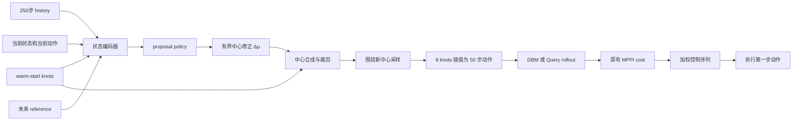

# 用强化学习生成 MPPI 采样中心：设计与实施方案

更新时间：2026-08-02。

当前数据、已完成代码和下一项任务以
[MPPI sampling-center 策略网络：工作交接](mppi_sampling_center_handoff_20260802.md)
为准。恢复工作时先读交接文档。

本文面向第一次接触强化学习和学习型优化器的读者，说明如何在 AnyCar 当前
PyTorch MPPI 基础上，引入一个策略网络生成更好的采样中心。本文首先解释概念，
再给出输入输出、奖励、数据、训练、验证和部署方案。

相关现状文档：

- [MPPI 采样序列优化：当前固定状态](mppi_sampling_optimization_status_20260730.md)
- [Query 模型的 PyTorch / ONNX MPPI 接入](query_mppi_pytorch_onnx_20260730.md)
- [0.21 m 小车 Query 数据、训练和 MPPI 对比](small_car_query_dt005_20260730.md)

## 1. 一句话目标

当前 MPPI 每个控制周期都围绕 warm start 做高斯采样。我们希望训练一个策略网络，
根据车辆状态、历史、参考轨迹和 warm start，先预测一个更合适的采样中心，再让
MPPI 围绕这个中心进行有限数量的 rollout。

```text
当前方式：warm start ──高斯采样──> MPPI 候选

目标方式：warm start + 状态 + reference
                    │
                    ▼
                 策略网络
                    │
                    ▼
                新采样中心 ──高斯采样──> MPPI 候选
```

策略网络不直接代替 MPPI，也不直接决定最终执行动作。MPPI 仍然负责：

- 生成中心附近的多个候选控制序列；
- 使用 DBM 或 Query 模型预测候选轨迹；
- 计算原有 tracking 和 action-rate cost；
- 根据 cost 选择或加权得到最终控制序列；
- 保持动作范围和现有控制接口不变。

这相当于给 MPPI 增加一个“学习得到的 proposal”，目标是把有限的 rollout 预算
放在更有价值的区域。

## 2. 为什么先学习采样中心，而不是直接用 RL 开车

端到端 RL 可以直接从状态输出 acceleration 和 steering，但这会同时替换当前的
预测模型、轨迹 cost、约束处理和 MPPI 搜索，验证边界很大，也很难判断性能变化
来自哪里。

本方案只替换候选生成中的一个环节：采样均值。这样有四个好处：

1. 现有 DBM、Query、cost 和 ROS 控制链路可以继续使用；
2. 即使策略网络预测不完全准确，MPPI 仍能在中心附近搜索；
3. 策略输出可以限制在 warm start 附近，容易增加回退机制；
4. 策略网络可单独导出 ONNX，而 rollout backend 仍可选择 PyTorch 或 ONNX。

因此第一阶段应把策略看成“学习型优化器”或“proposal policy”，而不是完整自动
驾驶策略。

## 3. 当前 MPPI 在做什么

### 3.1 当前固定参数

当前采样研究使用：

| 项目 | 当前设置 |
|---|---:|
| 控制周期 | `0.05 s` |
| 预测长度 | 50 步，即 2.5 s |
| 历史长度 | 250 步，即 12.5 s |
| 每条控制序列 | `[50,2]` |
| knot 数量 | 8 |
| 采样中心 | `[8,2]`，共 16 个标量 |
| 默认候选数 | 256 |
| 默认采样标准差 | `[0.25,0.35]` |
| 动作范围 | `[-1,1]` |

两个控制通道分别是 acceleration 和 steering。8 个 knots 经过线性插值形成 50 步
控制序列。

### 3.2 什么是采样中心

将 8×2 的 knots 展开，可以写成一个 16 维向量：

$$
\mu\in\mathbb{R}^{16}
$$

当前中心通常来自上一周期最优序列左移后的 warm start。第 \(i\) 条候选为：

$$
z_i=\operatorname{clip}(\mu+\sigma\odot\epsilon_i,-1,1)
$$

其中：

- \(\mu\)：采样中心；
- \(\sigma\)：每个控制通道的采样尺度；
- \(\epsilon_i\)：高斯随机扰动；
- \(z_i\)：第 \(i\) 条候选 knots。

如果中心离好解很远，大多数随机样本都会得到很高 cost。当前固定 DBM 快照中，
原始 256 条高斯候选的中位 cost 为 `253.9471`，但最优 cost 为 `5.0855`，ESS
只有 `1.442`。这说明大部分 rollout 对最终输出贡献很低。

### 3.3 当前多轮经验引导

目前实现的串行引导会利用第一批候选的控制扰动和轨迹误差，拟合一个局部经验
响应，再计算近似 Gauss-Newton 修正。它不需要模型梯度，但每个新状态都必须先
进行一轮较宽采样，才能估计修正方向。

策略网络的目标是把大量历史状态上学到的经验“摊销”到一次前向推理中：

```text
传统迭代优化：新状态 → rollout → 拟合响应 → 更新中心
学习型 proposal：新状态 → 策略网络直接预测较好中心
```

这通常称为 amortized optimization，即用训练成本换取在线优化速度。

## 4. 强化学习中的几个基本概念

在本任务中，强化学习术语对应如下：

| RL 概念 | 本任务中的含义 |
|---|---|
| 状态 `s` | 车辆历史、当前状态、reference、warm start 等 |
| 动作 `a` | 策略输出的 16 维采样中心修正 |
| 环境 | DBM 仿真和 MPPI 候选评估 |
| 奖励 `R` | 新中心产生的候选和最终 MPPI 输出有多好 |
| 策略 `πθ` | 从状态映射到采样中心的神经网络 |
| episode | 单个固定快照，或后续的一整段闭环仿真 |

一个重要区别是：第一阶段每个快照只做一次策略决策，随后立刻得到 cost。这更接近
contextual bandit，而不是具有很长时间信用分配的完整 RL。

先解决单步问题更容易：如果策略连“给定一个状态，产生更好的下一批采样中心”都
做不到，直接做整圈 PPO 或 SAC 很难诊断。

## 5. 推荐的整体结构



推荐策略输出中心的相对修正，而不是绝对控制序列：

$$
\Delta\mu_\theta=\Delta\mu_{max}\tanh(f_\theta(s))
$$

$$
\mu_\theta=
\operatorname{clip}
\left(
\mu_{warm}+g\Delta\mu_\theta,
-1,1
\right)
$$

其中 \(g\in[0,1]\) 可以是固定 trust 系数，也可以由网络额外预测。初版建议固定
\(g\)，并把每个维度的最大修正限制在大约一个原始采样标准差内。

这样即使网络输出异常，中心也不会瞬间跳到完全不同的控制区域。

## 6. 策略网络的输入

### 6.1 保持与当前系统一致的原始输入

建议数据集保存完整原始输入：

| 输入 | 形状 | 含义 |
|---|---:|---|
| `history` | `[250,7]` | 5 维可观测 transition/state 表示和 2 维历史动作 |
| `initial_state` | `[5]` | `[x,y,yaw,vx,yawrate]` |
| `current_action` | `[2]` | 当前 acceleration、steering |
| `reference` | `[51,4]` | 当前点加未来 50 点 `[x,y,yaw,vx]` |
| `warm_knots` | `[8,2]` | 当前 MPPI warm start |
| `noise_sigma` | `[2]` | 当前 proposal 的基础采样尺度 |

如果策略只针对固定 MPPI 参数训练，`noise_sigma` 可以暂时不作为输入，但保存到
数据集有利于后续扩展。

### 6.2 reference 应变换到车体局部坐标

不建议直接把全局 `x/y/yaw` 输入网络。否则网络可能记住赛道中的绝对位置，而不是
理解车辆相对参考线的误差。

对于参考点 \((x_r,y_r,\psi_r)\) 和当前车辆位姿
\((x_0,y_0,\psi_0)\)，先计算：

$$
\begin{bmatrix}
x_r^{body}\\
y_r^{body}
\end{bmatrix}
=
\begin{bmatrix}
\cos\psi_0 & \sin\psi_0\\
-\sin\psi_0 & \cos\psi_0
\end{bmatrix}
\begin{bmatrix}
x_r-x_0\\
y_r-y_0
\end{bmatrix}
$$

航向误差使用：

$$
\Delta\psi_r=\operatorname{wrap}(\psi_r-\psi_0)
$$

网络输入中可以使用 `sin(Δyaw)` 和 `cos(Δyaw)`，避免角度在 \(-\pi/\pi\) 处不
连续。reference 特征可定义为：

```text
[x_body, y_body, sin(yaw_error), cos(yaw_error), vx_reference - vx_current]
```

### 6.3 是否复用 Query encoder

初版不建议直接复用 Query 大模型内部 encoder，原因是：

- proposal 应同时适用于 DBM 和 Query rollout；
- 单独的小网络更容易导出 ONNX、测试延迟和做消融；
- 复用 Query encoder 会把 proposal 和某个 checkpoint 强耦合；
- DBM 训练阶段并不需要加载 Query。

如果后续数据量不足，可以研究共享或冻结 Query history embedding，但不应作为第一
版的必要条件。

## 7. 策略网络的输出

### 7.1 第一版只输出中心均值

网络输出：

```text
delta_knots: [8,2]
```

对应 16 个连续动作维度。输出经过 `tanh`、逐通道缩放和 action clipping。

第一版保持以下内容不学习：

- knots 数量仍为 8；
- 采样标准差仍为 `[0.25,0.35]`；
- 候选插值方式不变；
- cost 和 temperature 不变；
- 最终 MPPI 加权方式不变。

这样可以单独回答“更好的中心是否有效”，避免中心、方差、covariance 同时变化后
无法归因。

### 7.2 后续再学习采样尺度

如果中心网络已经稳定，可以扩展输出：

$$
(\mu_\theta,\log\sigma_\theta)=\pi_\theta(s)
$$

但必须限制：

$$
\sigma_{min}\le\sigma_\theta\le\sigma_{max}
$$

再下一步才考虑低秩 covariance 或 mixture proposal。完整 16×16 covariance 参数
多、稳定性差，不适合作为初版。

## 8. 学习目标不是“最优动作”，而是“最优采样区域”

这是本方案最关键的技术区别。

如果只寻找一条最优控制序列，目标是：

$$
z^*=\arg\min_z C(z)
$$

但策略网络输出的是采样中心。固定采样数和方差后，更合适的目标是：

$$
\mu^*=\arg\min_\mu
\mathbb{E}_{\epsilon_{1:N}}
\left[
C_{MPPI}
\left(
\{\mu+\sigma\epsilon_i\}_{i=1}^N
\right)
\right]
$$

一条孤立的低 cost 控制序列周围可能非常差；把它直接作为中心后，有限的随机候选
不一定好。理想中心应位于一片相对宽、相对稳定的低 cost 区域。

因此 teacher 和 reward 都不能只关注单条最优候选。

## 9. 奖励函数设计

### 9.1 为什么不能只奖励 minimum cost

如果奖励定义为：

$$
R=-\min_i C_i
$$

网络可能学会输出一个高风险中心：大多数候选很差，但偶尔有一条候选很好。由于
minimum 对随机 seed 非常敏感，训练方差也会很大。

### 9.2 推荐的主要奖励

建议以最终 MPPI 加权输出在 DBM 中重新 rollout 的 cost 为主要指标：

$$
C_{out}=C_{DBM}(U_{weighted})
$$

再加入候选整体质量和中心偏移约束：

$$
L=
C_{out}
+\beta C_{softmin}
+\gamma C_{P10}
+\lambda\|\mu_\theta-\mu_{warm}\|_2^2
+\rho C_{boundary}
$$

强化学习奖励为：

$$
R=-L
$$

其中 soft-min 为：

$$
C_{softmin}=
-\tau\log
\left(
\frac{1}{N}
\sum_{i=1}^{N}
\exp(-C_i/\tau)
\right)
$$

各项含义：

- `C_out`：真正会被执行的加权输出质量；
- `C_softmin`：平滑地强调低 cost 候选，梯度和统计比 minimum 稳定；
- `C_P10`：要求最好的 10% 候选整体改善；
- 中心偏移惩罚：避免网络无理由远离 warm start；
- `C_boundary`：惩罚大量 knots 被裁剪到 `-1/1` 边界。

初版可以先使用 `C_out + β*C_softmin + λ*center_shift`，不要同时加入过多权重。
各 cost 应基于训练集统计量归一化，否则数值最大的分项会支配奖励。

### 9.3 奖励必须来自 DBM 真值

当前固定状态已经观察到：Query predicted cost 持续下降时，同一控制序列的 DBM
replay 可能恶化。因此：

- teacher 生成使用 DBM；
- RL 训练的主要 reward 使用 DBM；
- Query predicted cost 只能作为附加输入或诊断；
- 不允许仅凭 Query cost 判断 proposal 变好。

这可以降低策略和采样器共同利用 Query 长时域误差的风险。

## 10. 数据集应该怎么生成

### 10.1 单个固定状态只能做单元测试

当前 step 340 快照非常适合验证：输入、随机 seed、rollout 数量和 cost 都固定，
便于比较算法。但如果只用这个状态训练，网络只需记住一个常量中心，并没有学会
根据状态决策。

正式数据应覆盖：

- 直线、缓弯和急弯；
- 不同目标速度和当前速度；
- 正负横向误差；
- 正负航向误差；
- 不同 yaw rate；
- 好、一般和较差的 warm start；
- 不同控制饱和程度；
- 后续可加入参数扰动、执行延迟和少量观测噪声。

### 10.2 每条样本保存什么

建议每个 snapshot 保存：

```text
scenario_id
episode_id
control_step
history                 [250,7]
initial_state           [5]
initial_state_six       [6]       # DBM teacher 使用真实 vy
current_action          [2]
reference               [51,4]
warm_knots              [8,2]
noise_sigma             [2]
dbm_parameters
teacher_center          [8,2]
teacher_weighted_action [50,2]
teacher_metrics
random_seed
```

train/validation/test 必须按 episode 或完整仿真 session 拆分，不能把同一圈相邻帧
随机分散到三部分，否则会产生严重的数据泄漏。

### 10.3 teacher 如何生成

对每个 snapshot 使用比在线更多的 DBM 预算寻找高质量区域，例如：

- 多起点 guided MPPI；
- CEM；
- DBM-iLQR；
- 多种方法产生候选后统一用 DBM cost 复算。

teacher 可以先得到一组 elite 控制序列，然后使用 elite 的 cost 加权均值作为中心：

$$
\mu_{teacher}
=
\frac{
\sum_{i\in elite}w_i z_i
}{
\sum_{i\in elite}w_i
}
$$

更严格的做法是：对若干候选中心分别重复有限预算采样，选择在多个 seed 下
`C_out/P10` 最稳定的中心。这样 teacher 学到的是“适合在线采样的中心”，而不只是
一条最优动作。

## 11. 推荐训练流程

### 阶段 0：固定快照打通闭环

先只使用 DBM step 340：

1. 网络读取与正式系统相同的输入；
2. 输出 16 维 bounded center correction；
3. 使用固定 seed 生成候选；
4. DBM 计算 reward；
5. 检查网络输出、reward 和梯度/更新是否正常；
6. 与 warm start 和当前经验引导结果画同一套图。

这个阶段只验证代码，不报告泛化结论。

### 阶段 A：teacher 监督预训练

使用 teacher center 做行为克隆：

$$
L_{BC}=\|
\mu_\theta(s)-\mu_{teacher}
\|_2^2
$$

可以增加 smoothness 和边界损失。监督预训练的作用是让策略先进入合理区域，避免
RL 从随机输出开始产生大量极差候选。

### 阶段 B：单步 contextual-bandit 微调

对每个训练 snapshot：

```text
读取状态 s 和 warm start
策略输出中心 μθ
围绕 μθ 生成 N 条候选
DBM 并行 rollout
计算原有 cost 和 MPPI 加权输出
根据 C_out、soft-min、P10 和偏移得到 reward
更新策略和/或 critic
```

16 维连续动作可以使用 actor-critic。若采用标准 RL 算法，SAC 或 TD3 通常比
PPO 更适合重复利用昂贵的 DBM rollout 数据；但单步问题也可以直接训练一个
`Q(s,μ)` critic，再令 actor 最大化 critic 预测。

推荐保留行为克隆约束：

$$
L_{actor}=-Q(s,\mu_\theta(s))
+\eta\|\mu_\theta(s)-\mu_{teacher}\|^2
$$

它能减少策略在 critic 尚不准确时偏离数据分布。

### 阶段 C：学习第二轮更新器

初始中心策略只读取状态。第二个网络可以读取第一轮采样结果，学习如何更新中心：

$$
\Delta\mu_2
=
\pi_{update}
\left(
s,
\{\Delta z_i,C_i,r_i\}_{i=1}^{N_1}
\right)
$$

其中：

- `Δz_i`：候选相对当前中心的 16 维扰动；
- `C_i`：候选总 cost 和可选 cost 分项；
- `r_i`：轨迹相对 reference 的误差摘要；
- 样本集合的顺序不应影响输出。

网络可以使用 DeepSets：

$$
h_i=\phi(\Delta z_i,C_i,r_i)
$$

$$
h_{set}=\operatorname{mean/max/weighted\ sum}_i(h_i)
$$

$$
\Delta\mu_2=\rho(s,h_{set})
$$

也可以使用 set attention。DeepSets 更简单、更容易导出 ONNX，适合作为第一版。

这个 learned updater 相当于学习一个非线性的多状态优化规则，可以替代当前每帧
重新拟合的线性经验 Jacobian。

### 阶段 D：闭环仿真微调

单步 proposal 验证通过后，再把策略放入整圈控制：

```text
策略给中心 → MPPI 选动作 → 仿真前进一步 → 下一状态
```

此时 reward 可以包含：

- 每步 tracking cost；
- 出界或失稳惩罚；
- 完成进度；
- 控制平滑性；
- deadline miss；
- 一圈完成奖励。

闭环训练解决的是长期问题，例如当前一步 cost 略低但导致下一时刻 warm start 很差。
在单步模型成熟前不建议进入该阶段。

## 12. 推荐网络结构

第一版应优先选择小、稳定、ONNX 友好的结构。

```text
history [250,7]
    └─ Conv1d/GRU encoder ───────────────┐

ego reference [50,5]
    └─ Conv1d/GRU encoder ───────────────┤

current state/action
    └─ small MLP ────────────────────────┤→ fusion MLP → 16维 delta knots

warm knots [8,2]
    └─ flatten + MLP ────────────────────┘
```

一个可作为起点的规模：

| 模块 | 建议输出维度 |
|---|---:|
| history encoder | 128 |
| reference encoder | 128 |
| current state/action MLP | 64 |
| warm-knots MLP | 64 |
| fusion hidden | 256 → 256 |
| output | 16 |

这只是初始配置，不应在验证 proposal 定义之前大量调网络结构。若小网络无法拟合
teacher，再增加 temporal attention 或复用 Query embedding。

## 13. PyTorch 和 ONNX 部署

策略网络应与 rollout backend 解耦：

```text
proposal backend: PyTorch 或 ONNX
rollout backend : DBM、Query PyTorch 或 Query ONNX
```

推荐运行接口：

```text
center = proposal(history, state, action, reference, warm_knots)
actions = sampler(center, sigma, num_samples)
trajectory = rollout_backend(history, state, action, actions)
output = mppi_cost_and_weight(trajectory, actions)
```

ONNX 初版使用固定 batch=1 和固定输入长度，减少动态 shape 问题。导出后必须比较：

- PyTorch/ONNX center 最大绝对误差；
- clipping 前后是否一致；
- 相同 RNG 候选是否一致；
- 最终 MPPI cost 和第一步动作是否一致；
- 策略推理延迟和完整控制周期延迟。

部署时增加以下回退：

```text
网络加载失败        → 使用原 warm start
输出含 NaN/Inf       → 使用原 warm start
输出超过信赖域       → clamp 或使用原 warm start
推理超过 deadline    → 使用原 warm start
状态超出训练分布     → 降低 gate g 或使用原 warm start
```

JAX 版本不在维护范围内。

## 14. 公平对比方法

### 14.1 离线固定快照

所有方法必须使用相同：

- state/history/reference/current action；
- DBM 参数和真实初始 `vy`；
- cost 权重；
- 控制范围；
- 总 rollout 数量；
- 随机种子集合。

建议比较：

| 方法 | 在线 rollout 预算 |
|---|---:|
| 原始 warm-start 高斯 | 256 |
| 当前经验引导 | 128 + 128 |
| learned center | 256 |
| learned center 低预算 | 64、128 |
| learned center + updater | 64 + 64 或 128 + 128 |

RL 的离线训练 rollout 不计入在线预算，但必须单独报告训练成本。learned center 的
核心价值不仅是同预算 cost 更低，也可能是在 64/128 条候选下达到原来 256 条的
质量。

### 14.2 指标

每个 held-out snapshot 至少记录：

- DBM best candidate cost；
- DBM weighted-output cost；
- P10、median、P95；
- ESS 和 normalized ESS；
- cost `<5/<10/<20` 的候选数量；
- 中心相对 warm start 的距离；
- clipping 比例；
- 多 seed mean/std；
- proposal 推理和完整 MPPI 时间。

闭环还需记录：

- 横向和航向误差 MAE/RMSE/P95；
- 速度误差；
- 出界、失稳和未完成比例；
- 单圈时间；
- 控制变化率；
- 50 ms deadline miss。

不能只汇报平均 cost。P95、失败率和不同 seed 的稳定性至少与平均性能同等重要。

### 14.3 数据拆分

建议三层验证：

1. 固定 step 340：回归测试和画图；
2. 未参与训练的仿真 snapshots：离线统计；
3. 未参与训练的完整场景/参数：闭环泛化。

调参只能查看 train/validation，最终 test 在方案冻结后使用一次。实车数据不能与
仿真训练结果混在同一统计中。

## 15. 主要风险和对应措施

### 15.1 单状态记忆

风险：网络记住固定 step 340 的常量中心。

措施：按 episode 拆分大量状态，固定快照只作为单元测试。

### 15.2 奖励投机

风险：只优化 minimum cost，网络产生大量差候选，只期待偶然命中一条好样本。

措施：以 weighted output、soft-min、P10 和失败率为主要指标。

### 15.3 Query 模型漏洞

风险：策略和多轮采样共同利用 Query 预测误差，Query cost 降低而真实 DBM 恶化。

措施：teacher 和 reward 使用 DBM；Query 结果必须做 DBM replay；限制 proposal
偏离，并研究 DBM/Query 一致性判据。

### 15.4 中心修正过大

风险：策略输出离 warm start 太远，引起动作突变或进入训练分布外。

措施：输出 residual、`tanh`、逐通道 trust region、中心偏移惩罚和 fallback。

### 15.5 critic 外推误差

风险：actor 找到 critic 错误高估、但数据中不存在的中心。

措施：监督预训练、actor 的 teacher/behavior constraint、多个 critic、周期性 DBM
真值验证。

### 15.6 训练奖励好但闭环不好

风险：单步 cost 改善损害下一时刻 warm start 或产生抖动。

措施：单步通过后进行完整闭环训练和验证，并保留 action-rate 和中心变化惩罚。

### 15.7 计算延迟抵消采样收益

风险：策略网络太大，节省的 rollout 时间被网络推理消耗。

措施：从小网络开始，报告端到端延迟；主要目标之一是用 64/128 候选达到原 256
候选质量。

## 16. 推荐的第一版实验

第一版只回答一个问题：一个轻量网络能否跨状态预测比 warm start 更好的 16 维
采样中心？

### 16.1 范围

- rollout 真值：Torch DBM；
- 无观测噪声；
- 8 knots/16 维；
- 固定原始 sigma；
- 网络只输出 bounded center residual；
- 先不学习 covariance；
- 先不接 Query；
- 先不接 ROS 在线控制。

### 16.2 小规模数据

建议先生成一个 pilot 数据集，而不是立刻进行大规模训练：

- 数百到数千个、按完整仿真分组的 snapshots；
- 覆盖不同曲率、误差和 warm-start 质量；
- 每个状态用高预算 DBM teacher 产生候选中心；
- 留出完整 episode 作为 validation/test。

具体 snapshot 数量和 teacher 预算应先通过 DBM 吞吐测试决定，不在设计阶段写死。

### 16.3 训练顺序

1. teacher center 监督学习；
2. 在 validation snapshots 上比较 learned center 和 warm start；
3. 固定采样数做 contextual-bandit 微调；
4. 比较 64/128/256 三种运行预算；
5. 通过后再开发 learned updater；
6. 最后做闭环和 ONNX。

### 16.4 第一版成功标准

第一版不要求直接超过所有高预算优化器，但至少应满足：

- held-out snapshots 的 weighted-output DBM cost 稳定优于原 warm start；
- P95 和失败率不恶化；
- 多 seed 方差可接受；
- 输出很少触发 action clipping；
- 推理时间显著小于节省的 rollout 时间；
- PyTorch 和 ONNX 输出数值一致；
- 在固定 step 340 上能复现完整对比图，但结论来自多状态测试。

## 17. 建议代码和产物布局

闭环 snapshot 数据采集和验证器已于 2026-08-02 实现；T0 teacher/relabel 生成器与
验证器已于 2026-08-03 实现；proposal/训练代码继续按下列职责拆分：

```text
car_foundation/car_foundation/
  mppi_proposal_policy.py          # 网络和输入预处理
  mppi_proposal_runtime.py         # PyTorch/ONNX统一接口与fallback

scripts/model_verify/
  validate_mppi_closed_loop_dataset.py  # 已实现
  generate_dbm_proposal_teacher.py      # T0 已实现
  validate_dbm_proposal_teacher.py      # T0 已实现
  train_mppi_proposal_bc.py
  finetune_mppi_proposal_bandit.py
  evaluate_mppi_proposal_offline.py
  export_mppi_proposal_onnx.py
  evaluate_mppi_proposal_closed_loop.py

/disk/collect_data_from_anycar/mppi_rl_closed_loop/  # 已建立专用数据根目录
  <collection>/<episode>/

outputs/mppi_proposal/
  teacher/
  checkpoints/
  evaluations/
```

数据 manifest 应记录：代码 commit、DBM 参数、MPPI 参数、cost 权重、随机种子、
数据拆分和 teacher 配置，防止后续无法复现实验。

当前采集 schema、启动参数和首批 pilot 结果见
[固定 DBM 的 MPPI 闭环数据采集](mppi_closed_loop_dataset_collection_20260802.md)。
T0/T1 teacher 的标签定义、计划和当前结果见
[teacher 标签方案与实现状态](mppi_teacher_label_plan_20260803.md)。

## 18. 分阶段决策点

每个阶段完成后再决定是否扩大范围：

| 阶段 | 需要回答的问题 | 不通过时的处理 |
|---|---|---|
| 固定快照 | 接口、reward、采样是否正确 | 修正实现，不讨论 RL 效果 |
| BC | 网络能否拟合跨状态 teacher | 改输入/归一化/数据覆盖 |
| Bandit | DBM 真值下能否超过 BC/warm start | 检查奖励、critic 外推和随机性 |
| Learned updater | 是否优于当前线性经验更新 | 保留简单 BC proposal |
| 闭环 DBM | 是否改善整圈且不增加失败 | 加长期奖励和保守约束 |
| Query | Query 推理下是否保持 DBM replay 质量 | 不接在线 Query proposal |
| ONNX/ROS | 数值、延迟和 fallback 是否合格 | 保持离线研究状态 |

## 19. 2026-08-03 数据与 teacher 状态

- 已支持固定 DBM 参数的 schema-v2 闭环 snapshot、连续 trace、赛道固化、history mask、
  独立 seed 和自动退出；
- 正式集合 `fixed_dbm_train_seed_20260802_v2` 有 8 个 episode、96 个 fully-observed
  snapshot、24,576 条候选 rollout 和 4,208 条 step-0-through-525 trace；
- 8 个新 episode 与 3 个旧 pilot 全部通过 validator；
- 原始轨迹支持后续改变 cost 权重/temperature，以及 DBM/Query 分别重新标注；
- T0 teacher sidecar 已实现并在 96 帧上通过 source hash、cost/weight 和 label 独立复算；
- T0 平均 ESS 1.543，44/96 帧 warm 已是 best，20.8% 的 best candidate 发生 clipping，
  因而只作为 pipeline/初版 BC 标签，不能视作最终 teacher；
- T1 高预算/多中心 DBM teacher、reward sidecar、BC、critic 和策略闭环 A/B 尚未实现；
- 下一步不再盲目扩数据，先做 T1，并根据 bank 边界率和策略闭环分布偏移定向扩充。

## 20. 当前推荐结论

推荐从以下最小方案开始：

> 已复用现有 DBM candidates 打通可配置 cost-weight/temperature 的 T0 标签 sidecar；
> 下一步使用 DBM 高预算/多中心 teacher 生成跨状态监督目标，训练输出 16 维 bounded
> center residual 的轻量网络；随后在 DBM 上完成单步 contextual-bandit 和严格闭环
> A/B。DBM 阶段通过后才切换 Query 重新 rollout/relabel。

完成这一版后，再决定是否开发读取第一轮采样集合的 learned updater。相比直接做
整圈 PPO、直接学习 covariance 或让 RL 直接控制车辆，这条路径更容易验证每一步
究竟带来了什么收益，也最符合当前 PyTorch/ONNX MPPI 的接口和安全边界。

## 21. 术语表

| 术语 | 简单解释 |
|---|---|
| MPPI | 用大量随机控制序列预测未来，再按 cost 选择/加权的控制方法 |
| proposal | 用来生成候选的概率分布 |
| sampling center | proposal 的均值，即候选主要围绕哪里生成 |
| warm start | 上一周期控制序列左移后形成的初始猜测 |
| rollout | 使用模型预测一条候选控制序列会产生什么未来轨迹 |
| policy | 从输入状态映射到动作的网络；本文动作是中心修正 |
| teacher | 用高预算优化得到、用于监督网络的目标 |
| behavior cloning | 用监督学习模仿 teacher |
| contextual bandit | 每个状态只决策一次并立即获得奖励的简化 RL |
| actor | 输出采样中心的策略网络 |
| critic | 估计某状态下某中心预期奖励的网络 |
| ESS | MPPI 权重的有效样本数，越低表示权重越集中在极少候选 |
| soft-min | minimum 的平滑近似，通常比直接最小值稳定 |
| trust region | 限制每次中心修正不能过大的范围 |
| DBM replay | 把控制序列放回确定性自行车模型复算真实仿真 cost |
| amortized optimization | 用离线训练换取在线一次网络推理的优化方式 |
