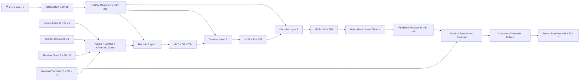
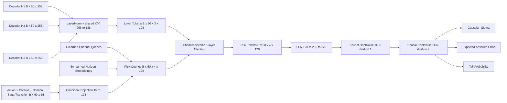
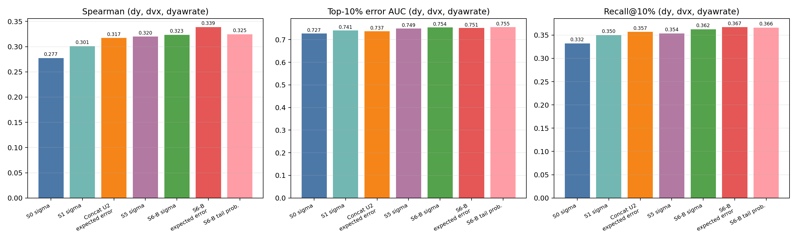
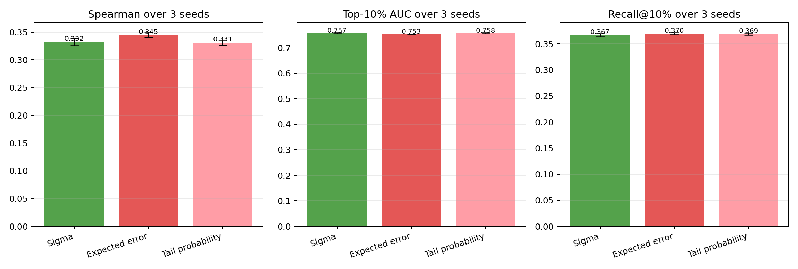
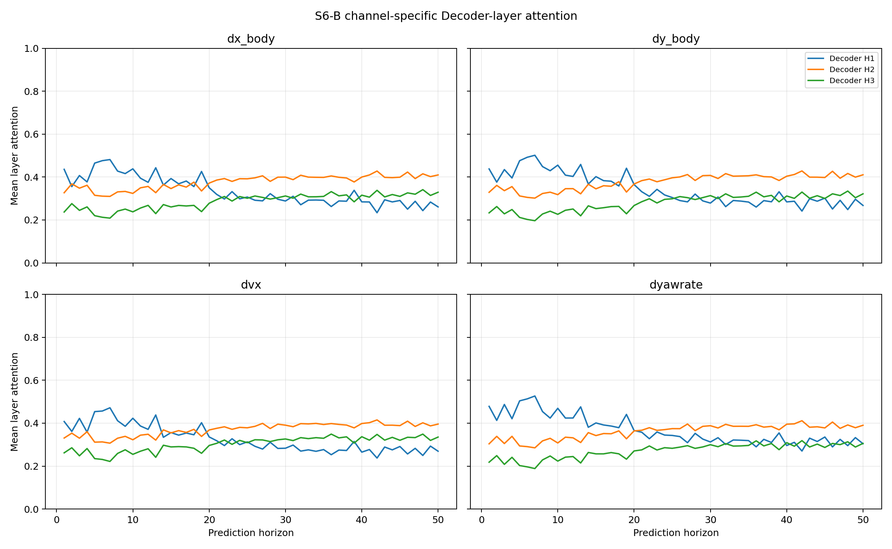
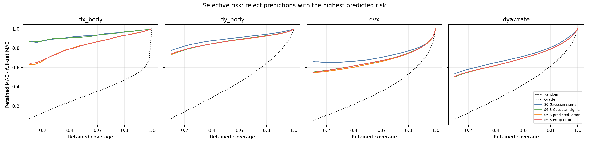
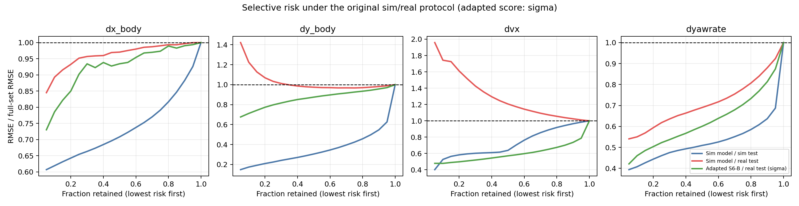
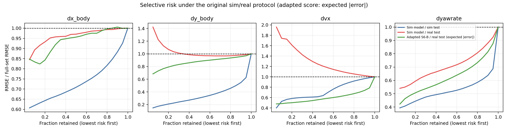

# AnyCar S6-B Layer-Time-Channel Risk Decoder

本文记录当前运动学残差 Query 模型上的 S6-B 概率/风险结构、训练协议、实车验证结果、选择性风险和 sim/real 对比口径。数据与结论截至 2026-07-29。

> **运行状态**：该概率方向已暂停，S6-B 仅作为离线实验和历史结果保留。默认训练/推理只运行运动学 nominal + 残差 + Query 的确定性均值模型，不加载本 Head。

S6-B 当前是验证模型，实现在：

```text
scripts/model_verify/verify_real_query_direct_risk_u2.py
```

它尚未合并到 `car_foundation/car_foundation/models.py`。确定性均值模型仍是 `TorchTransformerDecoderKinematicQueryMLP`，S6-B 只替换冻结均值模型之后的概率/风险 Head。

## 目录

1. [结论摘要](#1-结论摘要)
2. [数据和严格实验协议](#2-数据和严格实验协议)
3. [完整模型结构](#3-完整模型结构)
4. [S6-B 和 S0 的差异](#4-s6-b-和-s0-的差异)
5. [风险 Head 的训练与校准](#5-风险-head-的训练与校准)
6. [三随机种子实车结果](#6-三随机种子实车结果)
7. [Decoder 中间层结论](#7-decoder-中间层结论)
8. [概率能否作为置信度](#8-概率能否作为置信度)
9. [选择性风险](#9-选择性风险)
10. [sim/real 跨域曲线口径](#10-simreal-跨域曲线口径)
11. [计算量](#11-计算量)
12. [复现命令与产物](#12-复现命令与产物)
13. [结论边界和下一步](#13-结论边界和下一步)

## 1. 结论摘要

S6-B 让每个物理输出通道和每个预测 horizon 独立读取三层 Decoder 中间状态，并用两个轻量因果时序块建模未来 50 步的误差传播。在固定实车测试集上：

- 三个随机种子中，S6-B 最差一次的重点通道聚合 Spearman 和 AUC 仍高于 S5 History Cross-Attention；
- `Expected Absolute Error` 最适合连续精度估计和风险排序；
- `Tail Probability` 最适合判断是否超过固定误差阈值；
- `Sigma` 保留用于 Gaussian 区间，但 68% 中心区间仍偏保守；
- 概率可以作为同分布实车数据上的相对置信度，尚不能当作跨场景安全保证。

重点通道指：

```text
dy_body / dvx / dyawrate
```

`dx_body` 不计入重点聚合，但仍单独评估。

## 2. 数据和严格实验协议

### 2.1 均值模型

```text
outputs/formal_real_finetune_query_baseline_split/20260728T143256/query_best.pt
```

- 模型：`TorchTransformerDecoderKinematicQueryMLP`；
- checkpoint epoch：28；
- 预测对象：4 维运动学转移残差；
- 风险训练期间均值模型和原 Mean Head 全部冻结；
- S6-B 和 S0 的确定性测试误差逐元素一致。

### 2.2 数据

仿真数据：

```text
/disk/collect_data_from_anycar/New_demo/new_data_with_x_mean_zero/total_data_1
```

实车数据：

```text
/disk/collect_data_from_anycar/data_from_bag/new_temp_data/pkg_file
```

实车使用 acquisition-minute 隔离清单：

```text
outputs/splits/session_isolated_real_v1
```

### 2.3 概率训练拆分

| 用途 | 有效窗口数 |
|---|---:|
| Risk Head train | 7,737 |
| Risk Head validation | 3,885 |
| Calibration | 3,883 |
| Final real test | 5,456 |

每个通道在 final test 上有 `5,456 × 50 = 272,800` 个样本。测试集只在 checkpoint 选择和 calibration 完成后加载。

三层状态提取的审计结果：训练、验证、校准、测试四个拆分中，重新提取的 H3 与原最终 Decoder hidden 的最大绝对差均为 `0.0`。

## 3. 完整模型结构

### 3.1 冻结均值路径



### 3.2 S6-B 风险路径



两个 TCN 均使用 `kernel_size=3`，膨胀率为 1 和 2。S6-B Head 参数量为 `194,316`。

## 4. S6-B 和 S0 的差异

本文中的 S0 是 `s0_conditional_mlp`：最终 Decoder hidden 加相同显式条件的点式 Gaussian Head，不是更早的 6 维 direct 模型 Linear Sigma Head。

| 对比项 | S0 | S6-B |
|---|---|---|
| 均值模型 | 同一冻结模型 | 同一冻结模型 |
| Decoder 特征 | 只读取 H3 | 读取 H1/H2/H3 |
| 层融合 | 无 | 每个通道、horizon 动态 attention |
| 通道表示 | 四通道共享 128 维 trunk | 四组 Channel Query/Risk Token |
| 时间建模 | 各 horizon 独立 | 两层 causal TCN |
| 输出 | Sigma | Sigma、Expected Error、Tail Probability |
| 损失 | Gaussian NLL | NLL、绝对误差、tail 分类、ranking |
| 参数量 | 35,332 | 194,316 |
| Batch-1 Head 延迟 | 0.057 ms | 约 0.454 ms |

两者都不直接读取 History Memory；历史信息只通过冻结 Decoder 状态间接进入 Head。

## 5. 风险 Head 的训练与校准

### 5.1 训练目标

S6-B 同时优化：

```text
L = 0.25 * L_gaussian_nll
  + 1.00 * L_expected_abs_smooth_l1
  + 1.00 * L_tail_bce
  + 0.25 * L_pairwise_ranking
```

- `Expected Error` 目标为实际绝对残差；
- tail label 使用 risk-train 集上每通道绝对残差的第 90 百分位阈值；
- ranking loss 使用 batch 内配对误差差异；
- optimizer 为 AdamW，初始学习率 `1e-3`，每 epoch 乘 `0.99`；
- early-stop patience 为 10；
- 三随机种子最佳 epoch 为 `44 / 66 / 65`。

### 5.2 Calibration

Calibration 集独立于 Head train/validation：

- Sigma：拟合 `50 × 4` horizon/channel temperature；
- Expected Error：拟合 `50 × 4` direct scale；
- Tail Probability：每通道拟合 Platt scale 和 bias。

最终测试只使用已选 checkpoint 和固定 calibration 参数。

## 6. 三随机种子实车结果





### 6.1 重点通道聚合

| 模型/风险输出 | Spearman | Top-10% AUC | Recall@10% |
|---|---:|---:|---:|
| S0 Sigma | 0.2774 | 0.7275 | 0.3322 |
| S1 Sigma | 0.3008 | 0.7406 | 0.3499 |
| 三层 concat U2 Expected Error | 0.3170 | 0.7371 | 0.3570 |
| S5 History Cross-Attention Sigma | 0.3200 | 0.7491 | 0.3536 |
| S6-B Sigma，3 seeds | 0.3324 ± 0.0065 | 0.7574 ± 0.0023 | 0.3668 ± 0.0031 |
| **S6-B Expected Error，3 seeds** | **0.3449 ± 0.0045** | 0.7528 ± 0.0011 | **0.3698 ± 0.0020** |
| **S6-B Tail Probability，3 seeds** | 0.3310 ± 0.0046 | **0.7579 ± 0.0019** | 0.3691 ± 0.0022 |

S6-B Sigma 相比 S0 Sigma：Spearman、AUC、Recall 分别提升 `+0.0550 / +0.0299 / +0.0347`。

### 6.2 Expected Error 分通道

| 通道 | Spearman | Top-10% AUC | Recall@10% |
|---|---:|---:|---:|
| `dy_body` | 0.2085 ± 0.0045 | 0.6245 ± 0.0023 | 0.2135 ± 0.0030 |
| `dvx` | 0.4178 ± 0.0064 | 0.7896 ± 0.0014 | 0.4597 ± 0.0008 |
| `dyawrate` | 0.4083 ± 0.0030 | 0.8444 ± 0.0010 | 0.4363 ± 0.0026 |

主要收益来自 `dy_body` 和 `dvx`。`dyawrate` 的 Expected Error Spearman/AUC 略低于 S5 Sigma，但 Recall 更高。

## 7. Decoder 中间层结论



测试集平均注意力：

- horizon 1–10：H1 权重约 `41.5%–46.9%`；
- horizon 41–50：H1 降至约 `27%–31%`；
- 远期 H2 升至约 `39%–41%`，H3 升至约 `30%–33%`；
- `dyawrate` 的近期预测对 H1 依赖最强。

这说明最终 H3 确实丢失部分风险信息，而且固定全局层权重不适合所有 horizon 和状态通道。短期风险更依赖早期表征，长期风险逐渐转向 H2/H3。

当前实验验证的是“channel-specific layer attention + causal temporal block”的组合。尚未严格拆分 Layer Attention 和 Temporal Block 各自贡献。

## 8. 概率能否作为置信度

### 8.1 当前支持的用途

- 用 Expected Error 对同分布实车预测做相对精度排序；
- 用 Tail Probability 判断超过固定通道误差阈值的概率；
- 用经过 temperature calibration 的 Sigma 生成保守区间；
- 用于 shadow mode、预测降权、风险筛选和辅助降级。

推荐接口：

```text
prediction_mean
expected_abs_error
p_error_exceeds_threshold
gaussian_sigma
```

阈值相关置信度定义为：

```text
confidence(channel, horizon)
    = 1 - P(|error| > channel_threshold)
```

### 8.2 校准证据

主种子测试集上，Expected Error 平均预测值与实际平均绝对误差之比：

| 通道 | Predicted / actual mean absolute error |
|---|---:|
| `dy_body` | 0.979 |
| `dvx` | 1.009 |
| `dyawrate` | 1.009 |

重点通道等频风险分箱的相对校准误差约为 `4.5%–4.9%`。

Tail Probability 的测试 ECE：

| 通道 | ECE |
|---|---:|
| `dy_body` | 0.0065 |
| `dvx` | 0.0043 |
| `dyawrate` | 0.0038 |

Sigma 区间覆盖：

| 通道 | 68% | 90% | 95% |
|---|---:|---:|---:|
| `dy_body` | 72.9% | 90.5% | 94.1% |
| `dvx` | 80.0% | 92.8% | 95.3% |
| `dyawrate` | 70.4% | 91.2% | 95.4% |

90%/95% 区间接近名义覆盖，但 68% 区间偏宽。实车残差仍不完全符合 Gaussian。

### 8.3 不支持的用途

当前数据不能证明以下能力：

- 未见车辆、轮胎、载荷、路面或天气上的绝对置信度；
- 传感器异常或 action/state 明显越界时的 epistemic uncertainty；
- 可直接驱动安全控制切换的概率保证；
- 单个样本实际误差必然等于 Expected Error。

## 9. 选择性风险



该图横轴为保留的最低风险预测比例，纵轴为保留数据的 `MAE / full-set MAE`。越低表示风险分数越能筛掉高误差预测。

### 9.1 模型对比

| 风险输出 | Normalized AURC ↓ | 保留 50% 时 MAE 降低 | 保留 90% 时 MAE 降低 |
|---|---:|---:|---:|
| S0 Sigma | 0.7778 | 24.9% | 11.0% |
| concat U2 Expected Error | 0.7600 | 26.5% | 12.1% |
| S5 Sigma | 0.7499 | 27.5% | 11.9% |
| S6-B Sigma | 0.7479 | 27.8% | 12.3% |
| **S6-B Expected Error** | **0.7450** | **28.1%** | **12.5%** |
| S6-B Tail Probability | 0.7478 | 27.8% | 12.4% |

### 9.2 S6-B Expected Error 分通道

| 保留比例 | `dy_body` MAE 降低 | `dvx` MAE 降低 | `dyawrate` MAE 降低 |
|---|---:|---:|---:|
| 50% | 13.1% | 36.9% | 34.3% |
| 90% | 5.0% | 18.6% | 13.8% |

`dvx` 和 `dyawrate` 的选择价值较强，`dy_body` 仍然偏弱。所有模型与 Oracle 之间仍有明显距离。

## 10. sim/real 跨域曲线口径





跨域图沿用旧报告定义：

```text
Sim model / sim test
Sim model / real test
Adapted S6-B / real test
```

纵轴使用 `RMSE / full-condition RMSE`，而第 9 节同模型 Head 对比使用 `MAE / full-set MAE`。两类曲线不能直接比较数值。

Sigma 版本在保留最低风险 50% 预测时：

| 通道 | Sim/Sim RMSE 降低 | Sim/Real RMSE 降低 | Adapted S6-B/Real RMSE 降低 |
|---|---:|---:|---:|
| `dx_body` | 29.2% | 2.9% | 6.6% |
| `dy_body` | 69.5% | 2.6% | 12.5% |
| `dvx` | 36.2% | -20.6% | 42.9% |
| `dyawrate` | 49.1% | 31.0% | 39.9% |

Sim model 的 Sigma 直接转移到实车后明显失效；`dvx` 甚至出现负选择，即所谓低风险样本的 RMSE 更高。实车适配后的 S6-B 明显恢复 `dvx` 和 `dyawrate` 的风险排序。

重要限制：蓝色和红色曲线使用原 simulation probability head；绿色曲线使用实车训练的 S6-B。该图比较部署条件，不是严格的 Head 架构消融。若要研究 S6-B 本身的 sim-to-real transfer，必须另行在仿真拆分上训练 S6-B，再将同一个 S6-B Head 直接迁移到 real test。

## 11. 计算量

| Head | 参数量 | Batch-1 延迟 | Batch-256 延迟 |
|---|---:|---:|---:|
| S0 | 35,332 | 0.057 ms | 0.203 ms |
| concat U2 | 101,900 | 0.076 ms | 0.451 ms |
| S6-B | 194,316 | 约 0.454 ms | 约 4.89 ms |
| S5 | 4,560,132 | 1.117 ms | 18.288 ms |

均为同设备 Head-only microbenchmark。S6-B 参数量约为 S5 的 `4.3%`，Batch-1 Head 延迟约为 S5 的 `41%`。

## 12. 复现命令与产物

### 12.1 环境

```bash
source /home/plusai/miniconda3/etc/profile.d/conda.sh
conda activate anycar
cd /home/plusai/anycar
source set_env.sh
```

### 12.2 S6-B 主实验

```bash
python scripts/model_verify/verify_real_query_direct_risk_u2.py \
  --head-mode layer_time \
  --feature-mode concat \
  --epochs 100 \
  --patience 10 \
  --batch-size 256 \
  --feature-batch-size 512 \
  --seed 3407 \
  --output-dir outputs/formal_real_query_layer_time_risk_s6b
```

重复种子使用 `3408 / 3409`，必须写到独立输出目录。不得按 test 指标挑选部署 seed；三种子只用于稳定性审计。

### 12.3 跨域选择性风险

```bash
python scripts/model_verify/plot_s6b_sim_real_selective_risk.py
```

### 12.4 权威产物

```text
outputs/formal_real_query_layer_time_risk_s6b/20260728T180142
outputs/formal_real_query_layer_time_risk_s6b_seed3408/20260728T180522
outputs/formal_real_query_layer_time_risk_s6b_seed3409/20260728T180640
```

主 run 中：

- `summary.json`：全部指标、校准、attention 和训练历史；
- `test_risk_outputs.npz`：逐样本 error/sigma/expected error/tail probability；
- `u2_concat_layer_time_direct_risk_best.pt`：S6-B Head checkpoint；
- `08_selective_risk_s6b.png`：分通道选择性风险；
- `comparison/`：跨模型、三种子和 sim/real 图表。

## 13. 结论边界和下一步

优先级建议：

1. 做 S6-A（无 temporal block）和 S6-T（concat + temporal）以拆分层注意力和时序模块贡献；
2. 输出 `q50/q90/q95(|error|)`，使用 quantile loss 和独立 conformal calibration；
3. 加入历史 innovation encoder，编码真实转移与运动学名义转移之间的近期差异；
4. 使用 Adapter/LoRA 小步联合微调 Decoder，使均值表征主动保留不确定性信息；
5. 若需要 OOD 置信度，引入轻量 ensemble，并增加未见车辆/路面/工况测试。

在这些验证完成前，推荐把 S6-B 用于同分布实车上的风险排序、置信度显示和辅助降级，不直接作为安全保证。
