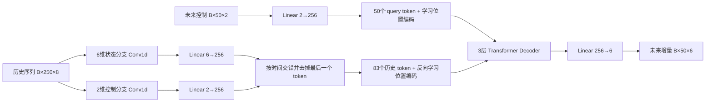

# AnyCar `TorchTransformerDecoder` 模型说明

> **版本说明（2026-07-29）**：本文记录旧版 6 维 direct `TorchTransformerDecoder`。当前默认模型是只输出确定性均值的 4 维运动学残差 Query 模型，见 [当前 Query 运动学残差模型与训练方式](current_kinematic_query_model_and_training_20260728.md)。

本文描述 AnyCar 当前主要动力学模型 `TorchTransformerDecoder` 的代码状态、数据语义、训练配置和已知约束。分析基于：

- 当前分支 `fork-main`，文档编写时 HEAD 为 `383d28ea8911ca734138ba15a308f54263e0c758`；
- 核心变更提交 `12d50a54f404b7f772ed20ce4aad7fe8e64059a8`（`update`，2026-07-21）；
- 核心实现 `car_foundation/car_foundation/models.py`；
- 主训练入口 `car_foundation/car_foundation/train_transformer_pytorch.py`。

当前 HEAD 中 `models.py` 与 `12d50a5` 的版本一致；之后的训练脚本改动主要是环境变量和磁盘路径调整。因此，下面对模型结构的说明同时适用于该提交和当前代码。

## 1. 模型定位

`TorchTransformerDecoder` 是一个基于历史状态/控制序列和未来候选控制序列，直接预测未来车辆状态增量的序列模型。

默认输入输出为：

| 张量 | 默认形状 | 含义 |
| --- | --- | --- |
| `history` | `[B, 250, 8]` | 250 帧历史；每帧为 6 维状态增量和 2 维控制量 |
| `action` | `[B, 50, 2]` | 未来 50 帧控制序列 |
| 输出 | `[B, 50, 6]` | 未来 50 帧的 6 维状态增量 |

6 维状态顺序为：

```text
[dx_body, dy_body, dyaw, dvx, dvy, dyawrate]
```

2 维控制量来自数据中的：

```text
[throttle, steer]
```

模型预测的是归一化后的增量，而不是绝对状态。推理后处理会反归一化，将车体系的 `dx/dy` 旋转到世界坐标系，再逐帧累加得到未来绝对轨迹。

## 2. 总体结构



核心超参数为：

| 参数 | 当前默认值 |
| --- | ---: |
| `state_dim` | 6 |
| `action_dim` | 2 |
| `output_dim` | 6 |
| `latent_dim` | 256 |
| `num_heads` | 4 |
| `num_layers` | 3 |
| Decoder FFN 维度 | 512 |
| `dropout` | 0.1 |
| `history_length` | 250 |
| `prediction_length` | 50 |
| `compressed_history_length` | 42 |
| 基线参数量 | 2,410,838 |

### 2.1 历史序列压缩

状态和控制使用两个独立的一维卷积分支压缩时间轴：

```text
状态: 250 --Conv(k=5,s=3,p=2)--> 84 --Conv(k=3,s=2,p=1)--> 42
控制: 250 --Conv(k=5,s=3,p=1)--> 83 --Conv(k=3,s=2,p=1)--> 42
```

压缩后的状态与控制分别映射到 256 维，然后按每个压缩时间点交错排列：

```text
[state_0, action_0, state_1, action_1, ..., state_41, action_41]
```

模型删除最后一个 token，最终得到 83 个 history/memory token。这样既能压缩 250 帧历史的注意力开销，也保留状态与动作两种来源的独立表示。

历史位置编码是可学习参数，并使用 `flip=True` 反向排列；未来动作 query 使用长度为 50 的正向可学习位置编码。

### 2.2 Transformer Decoder

未来控制序列被映射成 Decoder 的 `tgt`，压缩后的历史序列作为 `memory`。每层包含：

- 未来 query 之间的 masked self-attention；
- query 对历史 memory 的 cross-attention；
- 512 维前馈网络。

固定的 `tgt_mask` 是 50×50 因果 mask，因此第 `t` 个输出只能访问第 `0..t` 个未来控制 query。最后通过 `Linear(256, 6)` 一次输出全部 50 帧状态增量；这不是逐次调用模型的自回归 rollout。

## 3. 数据和训练语义

主训练脚本使用 `MujocoDataset`。原始记录字段为：

```text
[x, y, yaw, vx, vy, yawrate, throttle, steer]
```

数据集先计算相邻帧的 6 维状态差分，并把 `dx/dy` 从世界坐标系旋转到车辆坐标系。训练脚本请求 251 帧历史，随后丢弃第一帧无效差分，实际送入模型 250 帧。

训练目标和历史中的前 6 个通道使用训练集统计量进行标准化；控制量不做这一步标准化。损失是带 mask 的加权 MSE：

```text
[dx,  dy,  dyaw, dvx, dvy, dyawrate]
[0.5, 0.5, 2.0, 0.5, 0.0, 2.5]
```

其中 `dvy` 权重为 0，因此它虽然存在于模型输出中，但当前损失不会直接监督该通道。

当前默认训练设置：

| 配置 | 默认值 |
| --- | --- |
| Device | CUDA only |
| Batch size | 512 |
| Epoch | 400 |
| Optimizer | AdamW |
| 初始学习率 | `5e-4` |
| Weight decay | `1e-4` |
| 验证间隔 | 20 epoch |
| 数据拆分 | 80% train / 15% val / 5% test |
| Fine-tune | 默认开启 |
| 默认模型变体 | `baseline` |

训练入口可通过 `ANYCAR_*` 环境变量覆盖模型变体、数据路径、checkpoint、batch size、epoch 和学习率等配置。

## 4. `12d50a5` 提交引入的模型变化

该提交没有替换基线 Decoder，而是在保留 `TorchTransformerDecoder` 的基础上做了 CUDA 路径优化，并加入三种 query 增强变体。

### 4.1 基线 CUDA/推理路径调整

主要变化包括：

- 卷积压缩器显式移动到目标 device；
- history 使用 non-blocking device copy 和 contiguous 内存布局；
- 压缩分支显式走 CUDA；
- `eval()` 时只编码 batch 中第一条 history，再复制给整个 batch。

最后一项是面向 MPPI/候选轨迹批量推理的优化：同一批候选 action 通常共享同一份车辆历史，因而历史只需编码一次。但这也形成了一个重要前提：

> `eval()` 模式下，batch 内所有样本必须共享相同 history。若把不同车辆或不同时间点的 history 放在同一推理 batch，除第一条之外的 history 都会被忽略，结果不正确。

训练模式不会复用第一条 history，而是逐样本编码完整 batch。

### 4.2 Current-state query 变体

当前共有以下四个 Decoder 类：

| 类 | Query 构造 | 默认参数量 | 主训练脚本可选 |
| --- | --- | ---: | --- |
| `TorchTransformerDecoder` | `action_embedding(action)` | 2,410,838 | 是，`baseline` |
| `TorchTransformerDecoderCurrentState` | `Linear([action, current])` | 2,413,654 | 是，`current_concat_linear` |
| `TorchTransformerDecoderCurrentStateMLP` | baseline query + MLP residual | 2,445,270 | 是，`current_concat_mlp` |
| `TorchTransformerDecoderKinematicQueryMLP` | 上述 query + nominal kinematic MLP residual | 2,480,854 | 否，使用专用实验脚本 |

`TorchTransformerDecoderCurrentState` 将每个未来 action 与同一个 current context 拼接，再通过线性层映射为 query。加载旧 baseline checkpoint 时，训练入口允许新的 fusion 参数缺失，并调用 `init_fusion_from_action_embedding()`，使初始化输出与原 action embedding 对齐。若从头直接实例化该类而不调用此方法，fusion 层保持普通随机初始化。

`TorchTransformerDecoderCurrentStateMLP` 保留 baseline action embedding，并叠加一个两层 SiLU MLP：

```text
query = action_embedding(action) + MLP([action, current])
```

MLP 最后一层零初始化，所以新建模型和从 baseline 迁移时，初始 query 与 baseline 完全一致，之后再学习 current context 带来的残差修正。

需要注意，主训练入口没有显式传入绝对 `current_state`。默认 `current_dim=8` 时，变体实际读取：

```python
history[:, -1, :8]
```

这里的前 6 维是归一化后的最近一步状态增量，后 2 维是控制量，并非 `[x, y, yaw, vx, vy, yawrate]` 绝对状态。因此类名中的 “CurrentState” 在主训练路径下更准确地说是 “latest history context”。如果实验目标是注入真实当前车辆状态，应由调用方显式构造并传入 `current_state`，同时重新确认量纲和归一化方式。

### 4.3 Kinematic query 与残差/概率模块

`TorchTransformerDecoderKinematicQueryMLP` 在 current-state MLP query 上再增加一条 DyTR 风格的名义运动学分支：

```text
query += MLP([action, current, nominal_state(5), nominal_transition(4)])
```

该分支最后一层同样零初始化，因此加载 `TorchTransformerDecoderCurrentStateMLP` checkpoint 后能在初始化时保持原预测不变。`nominal_state` 和 `nominal_transition` 必须同时提供，默认形状分别为 `[B, 50, 5]` 和 `[B, 50, 4]`。

同一提交还加入：

- `kinematic_residual.py`：固定自行车模型、可观测 5 维状态、名义 rollout、学习残差和多 horizon 指标；
- `probabilistic_residual.py`：冻结均值模型后训练 Gaussian scale head，以及 Gaussian/Student-t NLL 和温度校准工具；
- `probability_shift.py`：校准集与测试集之间的分布/概率偏移分解；
- 对应的训练、消融、性能分析和测试脚本。

这些模块是围绕 Decoder 的实验和不确定性建模扩展，不会自动改变主训练入口的默认 `baseline` 模型。尤其是 kinematic query 目前不在 `create_decoder_model()` 的三个可选项中，需要使用专用 residual/ablation 脚本或显式实例化。

## 5. Checkpoint 兼容性

主训练入口的加载策略为：

- `baseline`：严格加载，参数 key 必须完全匹配；
- `current_concat_linear`：只允许 `action_fusion.weight/bias` 缺失；
- `current_concat_mlp`：只允许 fusion MLP 的四个参数缺失；
- 出现其他 missing/unexpected key 会报错；
- 新增 fusion 参数缺失时，执行 baseline-compatible 初始化。

Checkpoint 同时保存模型/优化器状态、模型变体、归一化统计量、数据路径和损失历史等信息。推理或继续训练时必须沿用 checkpoint 中的 `input_mean/input_std`，否则输入输出尺度会不一致。

Kinematic query 的兼容迁移由其专用脚本处理；主训练入口当前不会创建或加载该变体。

## 6. 当前实现约束与风险

1. **CUDA 硬依赖**：`_build_history_emb()` 内部直接调用 `.cuda()` 和 `torch.cuda.current_stream()`，所以即使构造函数传入 CPU device，完整 forward 也不能在 CPU 上运行；多 GPU 场景下还需确认默认 CUDA device 与 `self.device` 一致。
2. **eval batch 共享 history**：这是候选 action 批量推理的特化假设，不适用于普通异构推理 batch。
3. **固定序列长度**：learned position embedding 和 50×50 causal mask 按默认长度创建。当前主路径应使用 250 帧 history 和 50 帧 action；修改长度时必须同步核对卷积输出长度、position embedding 和 mask。
4. **padding mask 尺寸**：若传 `history_padding_mask`，其长度应对应压缩并交错后的 83 个 memory token，而不是原始 250 帧。主训练脚本目前传 `None`。
5. **`dvy` 无直接监督**：输出维度是 6，但当前损失中第五个通道权重为零。
6. **Current-state 命名与数据语义不完全一致**：主训练路径默认使用 latest normalized delta/action context，而非绝对当前状态。
7. **性能结论尚不能只由代码得出**：`12d50a5` 加入了 profiling、ablation、校准和验证工具，但模型优劣仍应以对应数据集、checkpoint 和实验产物为准；本文不把工具代码的存在当成精度或延迟收益证明。

## 7. 推荐的使用边界

- 需要保持现有生产/基准行为时，使用 `ANYCAR_MODEL_VARIANT=baseline`。
- 对同一历史生成大量候选控制轨迹时，可利用 `eval()` 的共享 history 优化，并确保 batch 内 history 相同。
- 比较 current context 的价值时，分别运行 `current_concat_linear` 与 `current_concat_mlp`，并明确记录传入的是 latest delta context 还是真实绝对 state。
- 研究名义运动学先验时，使用 `TorchTransformerDecoderKinematicQueryMLP` 和专用 kinematic residual 脚本，不要假设主训练入口已覆盖该路径。
- 部署或转换 ONNX 前，应分别验证数值一致性、固定长度约束和共享 history 假设。

## 8. 关键代码索引

- 基线及变体：`car_foundation/car_foundation/models.py`
- 主训练入口：`car_foundation/car_foundation/train_transformer_pytorch.py`
- 数据集与差分构造：`car_foundation/car_foundation/dataset.py`
- 运动学与残差：`car_foundation/car_foundation/kinematic_residual.py`
- 概率残差：`car_foundation/car_foundation/probabilistic_residual.py`
- 概率偏移分析：`car_foundation/car_foundation/probability_shift.py`
- Kinematic query 单测：`car_foundation/tests/test_kinematic_query_model.py`
